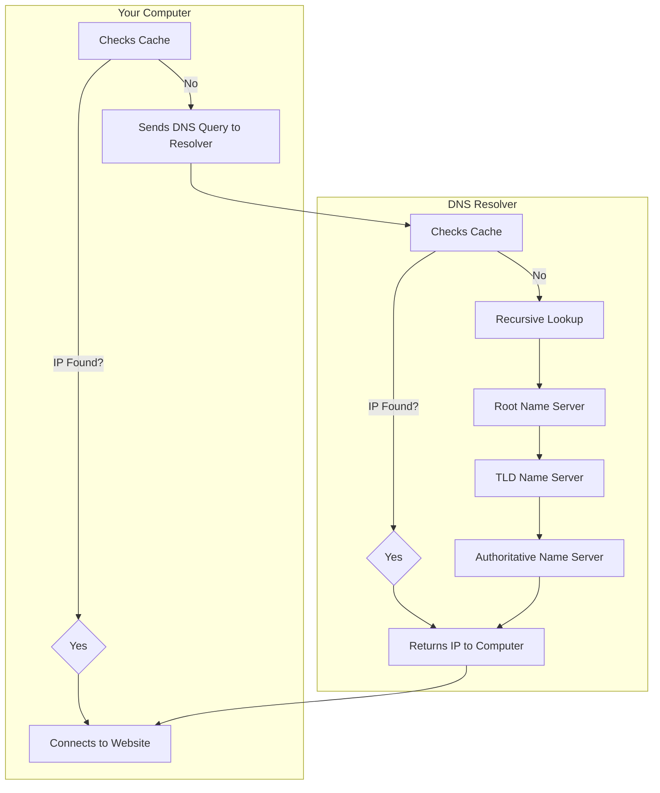
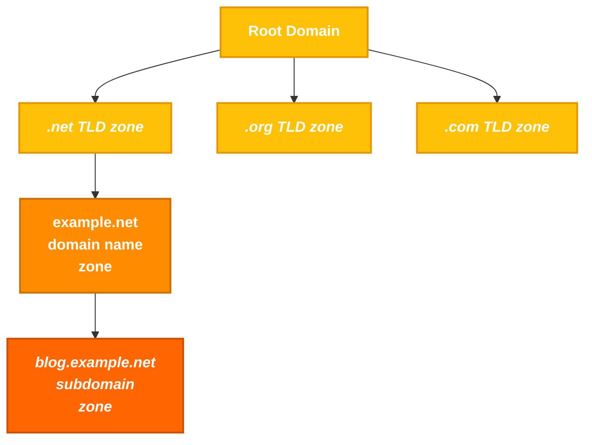

- [1. DNS](#1-dns)
- [2. The Hosts File](#2-the-hosts-file)
- [3. Digging DNS](#3-digging-dns)

## 1. DNS

### Basic  understanding

DNS (Domain Name System) acts like the **GPS of the Internet**, translating domain names into IP addresses to enable efficient online navigation. It quickly retrieves the IP address when a domain name is entered into a browser.  

### How DNS Works:  

1. When a user enters a **domain name**, the **PC checks its cache** to see if it has previously accessed and stored the domain's IP address.  
   - If the IP address is found, the PC sends the request directly.  
   - If not, it connects to a **DNS resolver** provided by the ISP.  

2. The **DNS resolver** also checks its cache.  
   - If the IP is found, it returns it to the PC.  
   - Otherwise, it forwards the request to a **Root Name Server**.  

3. The **Root Name Server** does not store specific IP addresses. Instead, it directs the resolver to the **Top-Level Domain (TLD) Name Server** (e.g., `.com`, `.org`).  

4. The **TLD Name Server** helps narrow down the search.  
   - It identifies which **Authoritative Name Server** holds the IP for the requested domain and directs the resolver there.  

5. The **Authoritative Name Server** provides the correct IP address.  
   - This is the final stop, where the exact IP address is stored and returned to the resolver.  

6. The **DNS resolver** sends the IP address back to the **PC**, storing it in its cache for a certain period in case the user wants to revisit the website soon.  

7. The **user's PC** connects to the website using the retrieved IP address.  

### illustration on how it works:



### Key DNS concepts

In the Domain Name System (DNS), a `zone` is a distinct part of the domain namespace that a specific entity or administrator manages. Think of it as a virtual container for a set of domain names. For example, `example.com` and all its subdomains (like `mail.example.com` or `blog.example.com`) would typically belong to the same DNS zone.

A `zone` is a portion of the domain name space that an authoritative DNS server manages. A zone contains DNS records and helps determine how to resolve domain names to IP addresses.

**Note (Distinguishing Zone and Domain):**
> - Domain: The entire domain name space on the Internet (e.g. example.com).
> - Zone: A portion of a domain managed by a specific DNS server (e.g. sub.example.com could be a separate zone).



The `zone file`, a text file residing on a DNS server, defines the resource records (discussed below) within this zone, providing crucial information for translating domain names into IP addresses.

To illustrate, here's a simplified example of what a zone file, for example.com might look like:

```bash
$TTL 3600 ; Default Time-To-Live (1 hour)
@       IN SOA   ns1.example.com. admin.example.com. (
                2024060401 ; Serial number (YYYYMMDDNN)
                3600       ; Refresh interval
                900        ; Retry interval
                604800     ; Expire time
                86400 )    ; Minimum TTL

@       IN NS    ns1.example.com.
@       IN NS    ns2.example.com.
@       IN MX 10 mail.example.com.
www     IN A     192.0.2.1
mail    IN A     198.51.100.1
ftp     IN CNAME www.example.com.

```

This file defines the authoritative name servers (`NS records`), mail server (`MX record`), and IP addresses (`A records`) for various hosts within the **example.com** domain.

DNS servers store various `resource records`, each serving a specific purpose in the domain name resolution process. Some of them are:

| **DNS Concept**               | **Description**                                                                 | **Example** |
|--------------------------------|-----------------------------------------------------------------------------|------------|
| **Domain Name**                | A human-readable label for a website or other internet resource.           | [www.example.com](http://www.example.com) |
| **IP Address**                 | A unique numerical identifier assigned to each device connected to the internet. | `192.0.2.1` |
| **DNS Resolver**               | A server that translates domain names into IP addresses.                     | Your ISP's DNS server or public resolvers like Google DNS (`8.8.8.8`) |
| **Root Name Server**           | The top-level servers in the DNS hierarchy.                                  | There are 13 root servers worldwide, named A-M: `a.root-servers.net` |
| **TLD Name Server**            | Servers responsible for specific top-level domains (e.g., .com, .org).       | Verisign for **.com**, PIR for **.org** |
| **Authoritative Name Server**  | The server that holds the actual IP address for a domain.                    | Often managed by hosting providers or domain registrars. |
| **DNS Record Types**           | Different types of information stored in DNS.                                | `A, AAAA, CNAME, MX, NS, TXT`, etc. |


`Record` types and their purposes:

| **Record Type** | **Full Name**                 | **Description**                                                                 | **Zone File Example** |
|----------------|------------------------------|-----------------------------------------------------------------------------|---------------------|
| **A**         | Address Record                | Maps a hostname to its IPv4 address.                                       | `www.example.com. IN A 192.0.2.1` |
| **AAAA**      | IPv6 Address Record           | Maps a hostname to its IPv6 address.                                       | `www.example.com. IN AAAA 2001:db8:85a3::8a2e:370:7334` |
| **CNAME**     | Canonical Name Record         | Creates an alias for a hostname, pointing it to another hostname.         | `blog.example.com. IN CNAME webserver.example.net.` |
| **MX**        | Mail Exchange Record          | Specifies the mail server(s) responsible for handling email for the domain. | `example.com. IN MX 10 mail.example.com.` |
| **NS**        | Name Server Record            | Delegates a DNS zone to a specific authoritative name server.              | `example.com. IN NS ns1.example.com.` |
| **TXT**       | Text Record                   | Stores arbitrary text information, often used for domain verification or security policies. | `example.com. IN TXT "v=spf1 mx -all"` (SPF record) |
| **SOA**       | Start of Authority Record     | Specifies administrative information about a DNS zone, including the primary name server, responsible person's email, and other parameters. | `example.com. IN SOA ns1.example.com. admin.example.com. 2024060301 10800 3600 604800 86400` |
| **SRV**       | Service Record                | Defines the hostname and port number for specific services.                | `_sip._udp.example.com. IN SRV 10 5 5060 sipserver.example.com.` |
| **PTR**       | Pointer Record                | Used for reverse DNS lookups, mapping an IP address to a hostname.         | `1.2.0.192.in-addr.arpa. IN PTR www.example.com.` |

**Take away:**
> - **Uncovering Assets:** DNS records can reveal a wealth of information, including subdomains, mail servers, and name server records. For instance, a **CNAME record** pointing to an outdated server (`dev.example.com CNAME oldserver.example.net`) could lead to a vulnerable system.
> - **Mapping the Network Infrastructure:** You can create a comprehensive map of the target's network infrastructure by analyzing DNS data. For example, identifying the **name servers (NS records)** for a domain can reveal the hosting provider used, while an **A record** for `loadbalancer.example.com` can pinpoint a load balancer. This helps you understand **how different systems are connected, identify traffic flow, and pinpoint potential choke points or weaknesses** that could be exploited during a penetration test.
> - **Monitoring for Changes:** Continuously monitoring DNS records can reveal **changes in the target's infrastructure over time**. For example, the sudden appearance of a **new subdomain** (`vpn.example.com`) might indicate a **new entry point into the network**, while a **TXT record** containing a value like `_1password=...` strongly suggests the organization is using **1Password**, which could be leveraged for **social engineering attacks or targeted phishing campaigns**.


## 2. The Hosts File

The **hosts** file is a simple text file used to map hostnames to IP addresses, providing a manual method of domain name resolution that bypasses the DNS process. While DNS automates the translation of domain names to IP addresses, the **hosts** file allows for direct, local overrides. This can be particularly useful for development, troubleshooting, or blocking websites.

The **hosts** file is located in:

- **Windows**: `C:\Windows\System32\drivers\etc\hosts`
- **Linux & macOS**: `/etc/hosts`


```bash

<IP Address>    <Hostname> [<Alias> ...]

```

**For example:**

```bash

127.0.0.1       localhost
192.168.1.10    devserver.local

```

To edit the **hosts file**, open it with a text editor using `administrative/root` privileges. Add new entries as needed, and then save the file. The changes take effect immediately without requiring a system restart.

Common uses include redirecting a domain to a local server for development:

```bash

127.0.0.1       myapp.local

```

testing connectivity by specifying an IP address:

```bash

192.168.1.20    testserver.local

```

or blocking unwanted websites by redirecting their domains to a non-existent IP address:

```bash

0.0.0.0       unwanted-site.com

```

---

## 3. Digging DNS

Some of the most popular and versatile tools in the arsenal of web recon professionals:

| **Tool**           | **Key Features**                                                                 | **Use Cases** |
|--------------------|--------------------------------------------------------------------------------|--------------|
| **dig**           | Versatile DNS lookup tool that supports various query types (A, MX, NS, TXT, etc.) and detailed output. | Manual DNS queries, zone transfers (if allowed), troubleshooting DNS issues, and in-depth analysis of DNS records. |
| **nslookup**      | Simpler DNS lookup tool, primarily for A, AAAA, and MX records.                 | Basic DNS queries, quick checks of domain resolution and mail server records. |
| **host**          | Streamlined DNS lookup tool with concise output.                                | Quick checks of A, AAAA, and MX records. |
| **dnsenum**       | Automated DNS enumeration tool, dictionary attacks, brute-forcing, zone transfers (if allowed). | Discovering subdomains and gathering DNS information efficiently. |
| **fierce**        | DNS reconnaissance and subdomain enumeration tool with recursive search and wildcard detection. | User-friendly interface for DNS reconnaissance, identifying subdomains and potential targets. |
| **dnsrecon**      | Combines multiple DNS reconnaissance techniques and supports various output formats. | Comprehensive DNS enumeration, identifying subdomains, and gathering DNS records for further analysis. |
| **theHarvester**  | OSINT tool that gathers information from various sources, including DNS records (email addresses). | Collecting email addresses, employee information, and other data associated with a domain from multiple sources. |
| **Online DNS Lookup Services** | User-friendly interfaces for performing DNS lookups. | Quick and easy DNS lookups, convenient when command-line tools are not available, checking for domain availability or basic information. |


### The Domain Information Groper

The `dig` command (Domain Information Groper) is a versatile and powerful utility for querying DNS servers and retrieving various types of DNS records. Its flexibility and detailed and customizable output make it a go-to choice.

Common dig Commands:

| **Command**                          | **Description** |
|--------------------------------------|---------------|
| `dig domain.com`                     | Performs a default A record lookup for the domain. |
| `dig domain.com A`                   | Retrieves the IPv4 address (A record) associated with the domain. |
| `dig domain.com AAAA`                | Retrieves the IPv6 address (AAAA record) associated with the domain. |
| `dig domain.com MX`                  | Finds the mail servers (MX records) responsible for the domain. |
| `dig domain.com NS`                  | Identifies the authoritative name servers for the domain. |
| `dig domain.com TXT`                 | Retrieves any TXT records associated with the domain. |
| `dig domain.com CNAME`               | Retrieves the canonical name (CNAME) record for the domain. |
| `dig domain.com SOA`                 | Retrieves the start of authority (SOA) record for the domain. |
| `dig @1.1.1.1 domain.com`            | Specifies a specific name server to query; in this case 1.1.1.1. |
| `dig +trace domain.com`              | Shows the full path of DNS resolution. |
| `dig -x 192.168.1.1`                 | Performs a reverse lookup on the IP address 192.168.1.1 to find the associated host name. You may need to specify a name server. |
| `dig +short domain.com`              | Provides a short, concise answer to the query. |
| `dig +noall +answer domain.com`      | Displays only the answer section of the query output. |
| `dig domain.com ANY`                 | Retrieves all available DNS records for the domain *(Note: Many DNS servers ignore `ANY` queries to reduce load and prevent abuse, as per [RFC 8482](https://tools.ietf.org/html/rfc8482)).* |


> **Note:** Some servers can detect and block excessive DNS queries. Use caution and respect rate limits. Always obtain permission before performing extensive DNS reconnaissance on a target.


### Example used:

```bash

$ dig google.com

; <<>> DiG 9.18.24-0ubuntu0.22.04.1-Ubuntu <<>> google.com
;; global options: +cmd
;; Got answer:
;; ->>HEADER<<- opcode: QUERY, status: NOERROR, id: 16449
;; flags: qr rd ad; QUERY: 1, ANSWER: 1, AUTHORITY: 0, ADDITIONAL: 0
;; WARNING: recursion requested but not available

;; QUESTION SECTION:
;google.com.                    IN      A

;; ANSWER SECTION:
google.com.             0       IN      A       142.251.47.142

;; Query time: 0 msec
;; SERVER: 172.23.176.1#53(172.23.176.1) (UDP)
;; WHEN: Thu Jun 13 10:45:58 SAST 2024
;; MSG SIZE  rcvd: 54

```

This output is the result of a DNS query using the dig command for the domain google.com. The command was executed on a system running DiG version 9.18.24-0ubuntu0.22.04.1-Ubuntu. The output can be broken down into four key sections:

**1. Header**
- `;; ->>HEADER<<- opcode: QUERY, status: NOERROR, id: 16449`:  
  This line indicates the type of query (**QUERY**), the successful status (**NOERROR**), and a unique identifier (**16449**) for this specific query.

- `;; Flags: qr rd ad; QUERY: 1, ANSWER: 1, AUTHORITY: 0, ADDITIONAL: 0`:  
  This describes the flags in the DNS header:
  - `qr`: Query Response flag - indicates this is a response.
  - `rd`: Recursion Desired flag - means recursion was requested.
  - `ad`: Authentic Data flag - means the resolver considers the data authentic.
  - The remaining numbers indicate the number of entries in each section of the DNS response:  
    1 question, 1 answer, 0 authority records, and 0 additional records.

- `;; WARNING: recursion requested but not available`:  
  This indicates that recursion was requested, but the server does not support it.

**2. Question Section**
- `;google.com. IN A`:  
  This line specifies the question: "What is the IPv4 address (A record) for **google.com**?"

**3. Answer Section**
- `google.com. 0 IN A 142.251.47.142`:  
  This is the answer to the query. It indicates that the IP address associated with **google.com** is **142.251.47.142**.  
  - The '`0`' represents the **TTL** (time-to-live), indicating how long the result can be cached before being refreshed.

**4. Footer**
- `;; Query time: 0 msec`:  
  This shows the time it took for the query to be processed and the response to be received (**0 milliseconds**).

- `;; SERVER: 172.23.176.1#53(172.23.176.1) (UDP)`:  
  This identifies the **DNS server** that provided the answer and the protocol used (**UDP**).

- `;; WHEN: Thu Jun 13 10:45:58 SAST 2024`:  
  This is the **timestamp** of when the query was made.

- `;; MSG SIZE rcvd: 54`:  
  This indicates the **size of the DNS message** received (**54 bytes**).

---

An **opt pseudosection** can sometimes exist in a `dig` query. This is due to **Extension Mechanisms for DNS (EDNS)**, which allows for additional features such as larger message sizes and **DNS Security Extensions (DNSSEC)** support.


