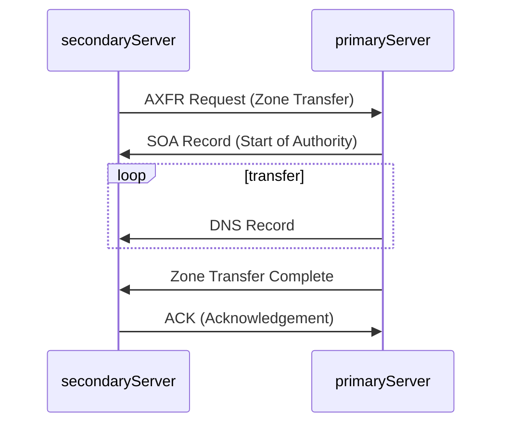

## 1. DNS Zone Transfer

A DNS zone transfer copies all DNS records of a domain and its subdomains from one name server to another. This ensures consistency and redundancy across DNS servers. However, if not properly secured, unauthorized users can download the entire zone file, exposing a full list of subdomains, IP addresses, and other sensitive DNS data.

**Why Does a DNS Zone Transfer Happen?**:

DNS zone transfers are crucial for keeping multiple DNS servers in sync. When a domain has multiple authoritative name servers, they need to share the same DNS records to provide accurate and consistent responses. Zone transfers ensure that secondary (backup) DNS servers receive updates from the primary DNS server, helping with:
- **Redundancy**: If one DNS server goes down, others can still resolve domain queries.
- **Load Balancing**: Multiple DNS servers can handle queries efficiently.
- **Faster Updates**: Changes to DNS records propagate across all authoritative servers.



The **zone transfer process** occurs as follows:
1. **Zone Transfer Request (AXFR):** The secondary DNS server requests a full zone transfer from the primary server.
2. **SOA Record Transfer:** The primary server responds with its Start of Authority (SOA) record, helping the secondary server verify if its data is up to date.
3. **DNS Records Transmission:** The primary server sends all DNS records (A, AAAA, MX, CNAME, NS, etc.) to the secondary server.
4. **Zone Transfer Complete:** The primary server signals the completion of the transfer.
5. **Acknowledgement (ACK):** The secondary server confirms successful receipt, completing the process.


## 2. The Zone Transfer Vulnerability

Zone transfers are crucial for DNS management, but a misconfigured server can become a security risk if unauthorized users can request transfers.

**Security Issue:**
In the early days of the internet, any client could request a zone transfer, exposing sensitive DNS data to attackers.

**Information Leaked:**
- **Subdomains:** Hidden subdomains hosting dev servers, staging environments, or admin panels.
- **IP Addresses:** Associated IPs, useful for reconnaissance or attacks.
- **Name Server Records:** Details about authoritative name servers, revealing hosting providers and misconfigurations.

**Exploiting Zone Transfers:** use the `dig` command to request a zone transfer. Example:

```bash

$ dig axfr @nsztm1.digi.ninja zonetransfer.me
```

This command instructs `dig` to request a full zone transfer (`axfr`) from the DNS server responsible for `zonetransfer.me`. If the server is misconfigured and allows the transfer, you'll receive a complete list of DNS records for the domain, including all subdomains:

```bash
$ dig axfr @nsztm1.digi.ninja zonetransfer.me

; <<>> DiG 9.18.12-1~bpo11+1-Debian <<>> axfr @nsztm1.digi.ninja zonetransfer.me
; (1 server found)
;; global options: +cmd
zonetransfer.me.	7200	IN	SOA	nsztm1.digi.ninja. robin.digi.ninja. 2019100801 172800 900 1209600 3600
zonetransfer.me.	300	IN	HINFO	"Casio fx-700G" "Windows XP"
zonetransfer.me.	301	IN	TXT	"google-site-verification=tyP28J7JAUHA9fw2sHXMgcCC0I6XBmmoVi04VlMewxA"
zonetransfer.me.	7200	IN	MX	0 ASPMX.L.GOOGLE.COM.
...
zonetransfer.me.	7200	IN	A	5.196.105.14
zonetransfer.me.	7200	IN	NS	nsztm1.digi.ninja.
zonetransfer.me.	7200	IN	NS	nsztm2.digi.ninja.
_acme-challenge.zonetransfer.me. 301 IN	TXT	"6Oa05hbUJ9xSsvYy7pApQvwCUSSGgxvrbdizjePEsZI"
_sip._tcp.zonetransfer.me. 14000 IN	SRV	0 0 5060 www.zonetransfer.me.
14.105.196.5.IN-ADDR.ARPA.zonetransfer.me. 7200	IN PTR www.zonetransfer.me.
asfdbauthdns.zonetransfer.me. 7900 IN	AFSDB	1 asfdbbox.zonetransfer.me.
asfdbbox.zonetransfer.me. 7200	IN	A	127.0.0.1
asfdbvolume.zonetransfer.me. 7800 IN	AFSDB	1 asfdbbox.zonetransfer.me.
canberra-office.zonetransfer.me. 7200 IN A	202.14.81.230
...
;; Query time: 10 msec
;; SERVER: 81.4.108.41#53(nsztm1.digi.ninja) (TCP)
;; WHEN: Mon May 27 18:31:35 BST 2024
;; XFR size: 50 records (messages 1, bytes 2085)
```

**Notice**: `zonetransfer.me` is a service specifically setup to demonstrate the risks of zone transfers so that the dig command will return the full zone record.
