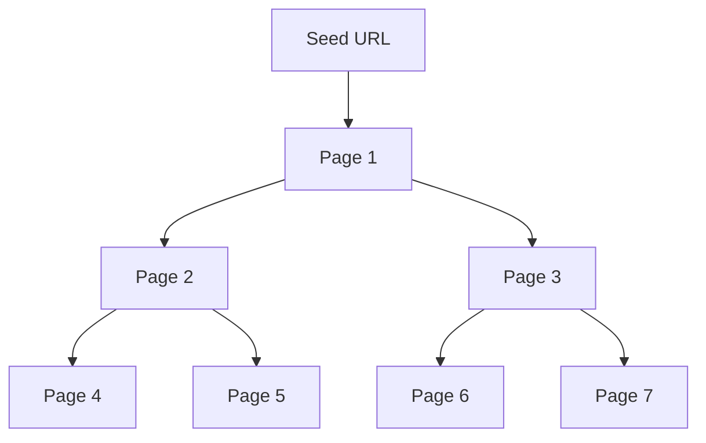
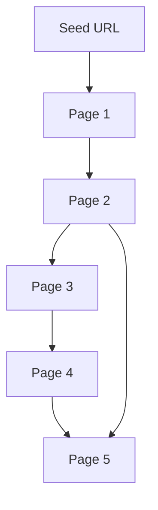

- [1. Crawling](#1-Crawling)
- [2. robots.txt](#2-robots.txt)
- [3. Well-Known URIs](#3-Well-Known-URIs)
- [4. Crawlers](#4-Crawlers)

# 1. Crawling

**Crawling**, also known as **spidering**, is the **automated process of systematically browsing the web**. Web crawlers, or bots, follow links from one page to another to collect information. These crawlers use algorithms to discover and index web pages, making them accessible through search engines or for tasks like data analysis and reconnaissance.

## How Web Crawlers Work

Web crawlers start with a **seed URL** (an initial web page). They:

1. **Fetch the page**, extract its content, and identify all links.
2. **Add these links to a queue** and crawl them one by one.
3. **Repeat the process**, exploring more of the website.

### Example:

1. **Starting at the Homepage**: The homepage contains **Link1, Link2, and Link3**.
   ```bash
      Homepage
         ├── link1
         ├── link2
         └── link3
   ```

2. **Following Link1**: Visiting **Link1** reveals more links: **Link2, Link4, and Link5**.
   ```bash
   link1 Page
      ├── Homepage
      ├── link2
      ├── link4
      └── link5
   ```

3. **Continuing the Crawl**: The crawler keeps following new links, collecting data as it goes.

> This process helps crawlers systematically **discover and index web pages**. Unlike fuzzing (which guesses potential links), crawling works by following actual links found on pages.

There are two primary types of crawling strategies: **Breadth-First Crawling** and **Depth-First Crawling**

### Breadth-First Crawling:



**Breadth-first crawling** prioritizes exploring a website's width before going deep. It starts by crawling all the links on the seed page, then moves on to the links on those pages, and so on. This is useful for getting a broad overview of a website's structure and content.

### Depth-First Crawling:



**Depth-first crawling** prioritizes depth over breadth. It follows a single path of links as far as possible before backtracking and exploring other paths. This can be useful for finding specific content or reaching deep into a website's structure.

## Extracting Valuable Information

Web crawlers gather various types of data, each playing a role in reconnaissance:

- **Links (Internal & External):** These help map a website's structure, uncover hidden pages, and identify external connections.
- **Comments:** User discussions on blogs or forums may reveal sensitive details or hints of vulnerabilities.
- **Metadata:** Includes page titles, descriptions, keywords, and author info, providing context about a website's content.
- **Sensitive Files:** Crawlers can find exposed backup files, configuration files, log files, or documents containing credentials or API keys.

### The Importance of Context

A single data point might not seem significant alone, but when combined with other findings, it can reveal vulnerabilities:

- **Pattern Recognition:** If multiple extracted links lead to a `/files/` directory, checking it manually might expose sensitive data.
- **Correlating Information:** A comment about a "file server" might seem harmless but gains importance if a directory with exposed files is also discovered.

By analyzing data holistically, you can connect the dots and uncover valuable security insights.

---

# 2. robots.txt

Think of a website as a grand house party. While guests are free to explore, some rooms are marked "Private." **robots.txt** works similarly—it tells web crawlers which parts of a website they can access and which are off-limits.

## What is robots.txt?

**robots.txt** is a simple text file placed in a website’s root directory (e.g., `www.example.com/robots.txt`). It follows the **Robots Exclusion Standard**, which provides rules for how web crawlers should behave. This file contains **directives** that tell bots which areas they can or cannot crawl.

### How robots.txt Works

The **directives** in `robots.txt` target specific **user-agents** (identifiers for different bots). Here’s an example:

```txt
User-agent: *
Disallow: /private/
```

`User-agent: *` → Applies to all bots (`*` is a wildcard).

`Disallow: /private/` → Blocks access to any URL starting with `/private/`.

Other directives can allow access to specific directories or files, set crawl delays to avoid overloading a server or provide links to sitemaps for efficient crawling.

### robots.txt Structure

The robots.txt file is a plain text document that lives in the root directory of a website. It follows a straightforward structure, with each set of instructions, or "record," separated by a blank line. Each record consists of two main components: 
1. `User-agent`: This line specifies which crawler or bot the following rules apply to. A wildcard (`*`) indicates that the rules apply to all bots. Specific user agents can also be targeted, such as "Googlebot" (Google's crawler) or "Bingbot" (Microsoft's crawler).
2. **Directives**: These lines provide specific instructions to the identified user-agent.

Common directives include:

| **Directive**   | **Description** | **Example** |
|---------------|----------------|------------|
| **Disallow**  | Blocks bots from crawling specific paths or patterns. | `Disallow: /admin/` (Blocks access to the admin directory) |
| **Allow**     | Grants bots permission to crawl specific paths, even if they fall under a broader `Disallow` rule. | `Allow: /public/` (Allows access to the public directory) |
| **Crawl-delay** | Sets a delay (in seconds) between bot requests to prevent server overload. | `Crawl-delay: 10` (Waits 10 seconds between requests) |
| **Sitemap**   | Provides the URL of an XML sitemap to improve crawling efficiency. | `Sitemap: https://www.example.com/sitemap.xml` |

### Why Respect robots.txt?

Although robots.txt isn't enforceable, most legitimate web crawlers follow its rules. Here’s why:

- **Avoid Server Overload**: Limits crawler access to prevent excessive traffic and server crashes.  
- **Protect Sensitive Data**: Prevents search engines from indexing private or confidential files.  
- **Legal & Ethical Compliance**: Ignoring robots.txt may violate terms of service or legal regulations.  

### robots.txt in Web Reconnaissance

robots.txt can reveal insights about a website's structure and security:

- **Finding Hidden Directories**: Disallowed paths may expose sensitive files, backups, or admin panels.  
- **Mapping Website Structure**: Allowed and disallowed paths help create a rough site map.  
- **Detecting Crawler Traps**: Some sites use "honeypot" directories to catch bots or attackers.  

## Analyzing robots.txt

```txt
User-agent: *
Disallow: /admin/
Disallow: /private/
Allow: /public/

User-agent: Googlebot
Crawl-delay: 10

Sitemap: https://www.example.com/sitemap.xml
```

This file contains the following directives:

- All user agents are disallowed from accessing the `/admin/` and `/private/` directories.
- All user agents are allowed to access the `/public/` directory.
- The `Googlebot` (Google's web crawler) is specifically instructed to wait 10 seconds between requests.
- The sitemap, located at `https://www.example.com/sitemap.xml`, is provided for easier crawling and indexing.
- By analyzing this robots.txt, we can infer that the website likely has an admin panel located at `/admin/` and some private content in the `/private/` directory.


# 3. Well-Known URIs

The **.well-known** standard (RFC 8615) defines a standardized directory within a website’s root domain. It is accessible via `/.well-known/` and stores critical metadata, such as configuration files and security policies.

Using **.well-known** simplifies discovery for web browsers, applications, and security tools by providing a consistent location for important files. For example, a website's security policy can be found at: `https://example.com/.well-known/security.txt`

The Internet Assigned Numbers Authority (IANA) maintains a registry of .well-known URIs, each serving a specific purpose defined by various specifications and standards. Below is a table highlighting a few notable examples:

| **URI Suffix**                        | **Description**                                                              | **Status**      | **Reference** |
|----------------------------------------|------------------------------------------------------------------------------|----------------|--------------|
| `security.txt`                         | Contains contact information for security researchers to report vulnerabilities. | Permanent      | RFC 9116 |
| `/.well-known/change-password`         | Provides a standard URL for directing users to a password change page.        | Provisional    | `https://w3c.github.io/webappsec-change-password-url/#the-change-password-well-known-uri` |
| `openid-configuration`                 | Defines configuration details for OpenID Connect, an identity layer on top of OAuth 2.0 protocol. | Permanent | `http://openid.net/specs/openid-connect-discovery-1_0.html` |
| `assetlinks.json`                      | Used for verifying ownership of digital assets (e.g., apps) associated with a domain. | Permanent | `https://github.com/google/digitalassetlinks/blob/master/well-known/specification.md` |
| `mta-sts.txt`                          | Specifies the policy for SMTP MTA Strict Transport Security (MTA-STS) to enhance email security. | Permanent | RFC 8461 |

This is just a small sample of the many .well-known URIs registered with IANA. Each entry in the registry offers specific guidelines and requirements for implementation, ensuring a standardized approach to leveraging the .well-known mechanism for various applications.


# 4. Crawlers

Popular Web Crawlers: 

1. **Burp Suite Spider**: Burp Suite, a widely used web application testing platform, includes a powerful active crawler called Spider. Spider excels at mapping out web applications, identifying hidden content, and uncovering potential vulnerabilities.

2. **Recommended: OWASP ZAP (Zed Attack Proxy)**: ZAP is a free, open-source web application security scanner. It can be used in automated and manual modes and includes a spider component to crawl web applications and identify potential vulnerabilities. `Tools --> Spider --> Scan`

3. **Scrapy (Python Framework)**: Scrapy is a versatile and scalable Python framework for building custom web crawlers. It provides rich features for extracting structured data from websites, handling complex crawling scenarios, and automating data processing. Its flexibility makes it ideal for tailored reconnaissance tasks.

4. **Apache Nutch (Scalable Crawler)**: Nutch is a highly extensible and scalable open-source web crawler written in Java. It's designed to handle massive crawls across the entire web or focus on specific domains. While it requires more technical expertise to set up and configure, its power and flexibility make it a valuable asset for large-scale reconnaissance projects.

**Notice:** Always obtain permission before crawling a website, especially if you plan to perform extensive or intrusive scans. Be mindful of the website's server resources and avoid overloading them with excessive requests.


