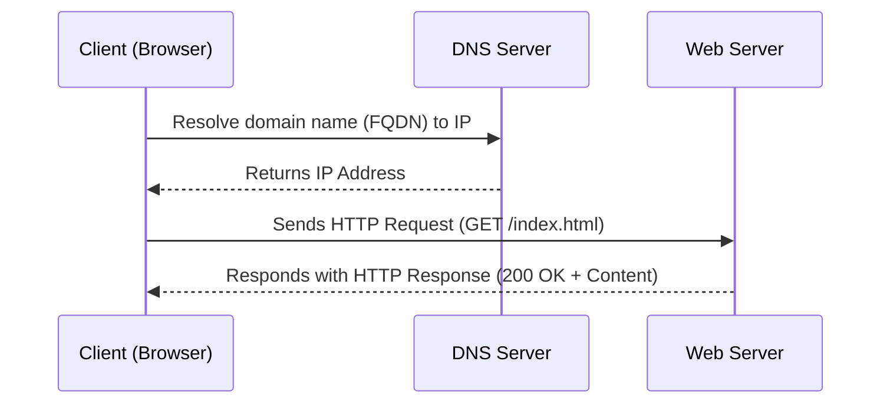
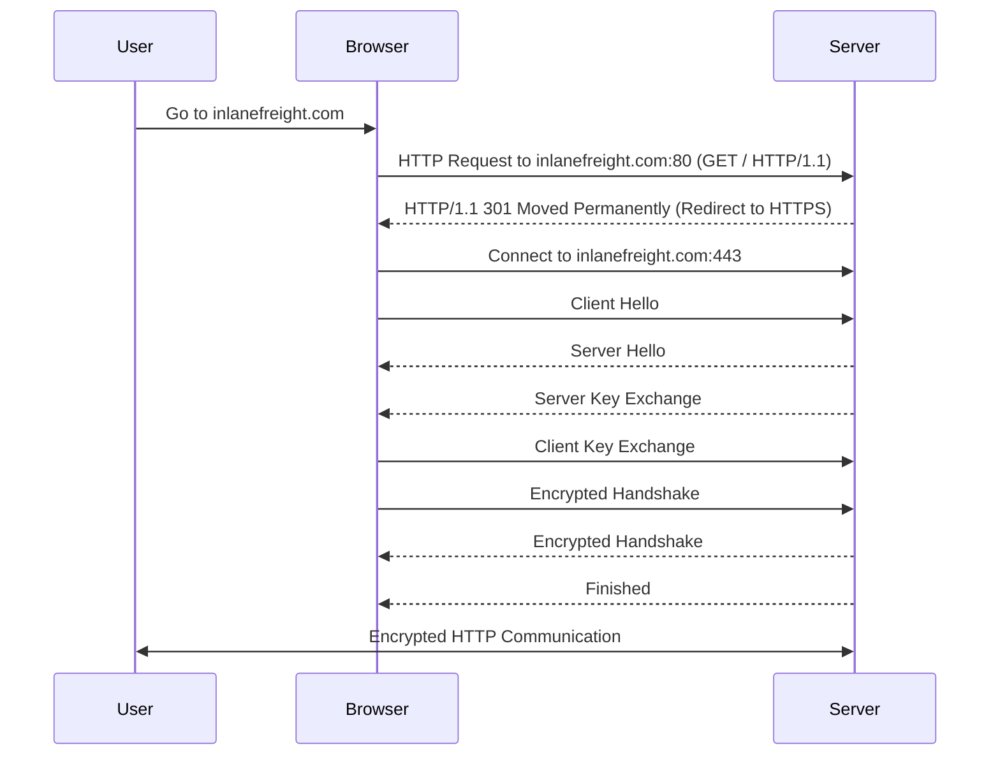

## Table of Contents

- [1. HTTP](#1-http)
- [2. HTTPS](#2-https)
- [3. HTTP requests and responses](#3-http-requests-and-responses)
- [4. HTTP Headers](#4-http-headers)
- [5. HTTP methods and codes](#5-http-methods-and-codes)
- [6. GET](#6-get)
- [7. POST](#7-post)
- [8. CRUD API](#8-crud-api)

## 1. HTTP

A **web request** is a request made by a **client**, such as a **web browser**, to a **server** in order to retrieve a **web page** or other **resource**. Web requests are sent using the **Hypertext Transfer Protocol (`HTTP`)**, which is a standard protocol for transmitting data on the **World Wide Web**.  

**`HTTP` communication** consists of a **client** and a **server**, where the **client** requests the **server** for a **resource**. The **server** processes the requests and returns the requested **resource**.  



More about **`HTTP`**:  
> 1. Most **internet communications** are made with **web requests** through the **`HTTP` protocol**.  
> 2. It is an **application-level protocol** used to access the **World Wide Web resources**.  
> 3. The term **hypertext** stands for text containing **links** to other **resources** and text that the readers can easily interpret.  
> 4. Default **port** for **`HTTP` communication** is **port `80`** (this can be changed to any other port, depending on the **web server configuration**).  

## 2. URL

Resources over HTTP are accessed via a URL (Uniform Resource Locator)


| Component   | Example                  | Description |
|------------|--------------------------|-------------|
| **Scheme**  | `http://`, `https://`    | Identifies the protocol, ends with `://`. |
| **User Info** | `admin:password@`      | Optional credentials, separated from the host by `@`. |
| **Host**    | `inlanefreight.com`      | Resource location (can be a hostname or IP). |
| **Port**    | `:80`                    | Defaults: `80` for HTTP, `443` for HTTPS. |
| **Path**    | `/dashboard.php`         | Points to a file or folder. If no path specified, server returns the default index |
| **Query String** | `?login=true`       | Starts with `?`, contains key-value pairs. |
| **Fragments** | `#status`              | Used by browsers to locate sections. |


> **Notice:**  
> - Not all components are required to access a resource.  
> - **Scheme** and **Host** are mandatory.  
> - Default, HTTP use port `80` and HTTPS use port `443`.
> - The query string starts with a “?”. It includes parameters and values. Parameters are separated by an & symbol.
> - In a URL, there can be many parameters, each parameter can have many different values.
> - 
> - In the above example, the first parameter is ``brands``, and has the value ``1146267,1073549,4119060,1068790``, separated by a space ``%2``. The second parameter is: ``keyword`` with the value ``backpack``, …
> - However, the length of a URL is usually limited by: Web browser, web server, and/or web applications to ensure performance, compatibility, and
security.

---

**Extend notice (about url, uri, urn):**

| Term  | Full Form                     | Purpose                                           | Example |
|-------|--------------------------------|---------------------------------------------------|---------|
| **URI** | Uniform Resource Identifier  | Generic identifier for a resource (name or location). | `https://example.com/index.html` (URL) <br> `urn:isbn:0451450523` (URN) |
| **URL** | Uniform Resource Locator     | Specifies the **location** of a resource and how to access it. | `https://www.example.com/index.html` |
| **URN** | Uniform Resource Name        | Uniquely **names** a resource without specifying its location. | `urn:isbn:0451450523` (Book ISBN) |


**Relationship**
- **A URL is a type of URI** that provides a location.  
- **A URN is a type of URI** that provides a unique name but no location.  
- A URI can be either a URL, a URN, or both, **But NOT BACKWARD.**  

---

`cURL` (client URL) is a command-line tool and library that primarily supports HTTP along with many other protocols.

**Curl Command Help**:

```bash
$ curl -h
Usage: curl [options...] <url>
 -d, --data <data>         HTTP POST data
 -h, --help <category>     Get help for commands
 -i, --include            Include protocol response headers in the output
 -o, --output <file>      Write to file instead of stdout
 -O, --remote-name        Write output to a file named as the remote file
 -s, --silent             Silent mode
 -u, --user <user:password> Server user and password
 -A, --user-agent <name>  Send User-Agent <name> to server
 -v, --verbose            Make the operation more talkative

```

## 3. HTTPS 

In HTTP, all data is transferred in clear-text, which make it vulnerable to Man-in-the-middle (MiTM) attack to view the transferred data.

To counter this issue, the HTTPS (HTTP Secure) protocol was created, in which all communications are transferred in an encrypted format, so even if a third party does intercept the request, they would not be able to extract the data out of it.

**HTTPS Flow:**


**Notice:** 
> - If we type `http://` instead of `https://` to visit a website that enforces `HTTPS`, the browser attempts to resolve the domain and redirects the user to the webserver hosting the target website. A request is sent to `port 80` first, which is the unencrypted HTTP protocol. The server detects this and **redirects** the client to secure HTTPS `port 443` instead. This is done via the **301 Moved Permanently** response code.
> - Depending on the circumstances, an attacker may be able to perform an HTTP downgrade attack, which downgrades HTTPS communication to HTTP, making the data transferred in clear-text. This is done by setting up a Man-In-The-Middle (MITM) proxy to transfer all traffic through the attacker's host without the user's knowledge. However, most modern browsers, servers, and web applications protect against this attack.

**cURL for HTTPS:**

cURL should automatically handle all HTTPS communication standards and perform a secure handshake and then encrypt and decrypt data automatically. However, if we ever contact a website with an invalid SSL certificate or an outdated one, then cURL by default would not proceed with the communication to protect against the earlier mentioned MITM attacks.

```bash
$ curl https://inlanefreight.com

curl: (60) SSL certificate problem: Invalid certificate chain
More details here: https://curl.haxx.se/docs/sslcerts.html
...SNIP...

```

We may face such an issue when testing a local web application or with a web application hosted for practice purposes, as such web applications may not yet have implemented a valid SSL certificate. **To skip the certificate** check with cURL, we can use the `-k` flag:

```bash
$ curl -k https://inlanefreight.com

<!DOCTYPE HTML PUBLIC "-//IETF//DTD HTML 2.0//EN">
<html><head>
...SNIP...

```

## 4. HTTP Requests and Responses

**HTTP communications** mainly consist of an `HTTP request` and an `HTTP response`. An `HTTP request` is made by the client (e.g. cURL/browser), and is processed by the server (e.g. web server). The requests contain all of the details we require from the server, including the resource (e.g. URL, path, parameters), any request data, headers or options we specify, and many other options. Once the server receives the `HTTP request`, it processes it and responds by sending the `HTTP response`, which contains the `response code`, and may contain the resource data if the requester has access to it.

For example, image below shows an **HTTP GET request** to the URL: `http://inlanefreight.com/users/login.html`


The first line of any HTTP request contains three main fields **separated by spaces**:

| Field                      | Example                                          | Description                                      |
|----------------------------|--------------------------------------------------|--------------------------------------------------|
| **HTTP Method**            | `GET`                                           | Retrieves data from the server.                 |
| **Path**                   | `/users/login.html`                             | Requested resource (endpoint).                   |
| **HTTP Version**           | `HTTP/1.1`                                      | HTTP protocol version being used.               |
| **Host**                   | `inlanefreight.com`                             | Target server domain.                           |
| **User-Agent**             | `Mozilla/5.0 (Ubuntu; Linux x86_64;) Firefox/78.0` | Identifies client details (browser, OS, etc.). |
| **Accept**                 | `text/html,application/xhtml+xml,application/xml` | Specifies acceptable response content types.    |
| **Accept-Language**        | `en-US,en;q=0.5`                                | Preferred languages for the response.           |
| **Accept-Encoding**        | `gzip, deflate`                                 | Supported compression formats.                  |
| **Content-Type**           | `text/html; charset=UTF-8`                      | Specifies content format in request/response.   |
| **Connection**             | `close`                                         | Indicates if the connection should be kept open. |
| **Cookie**                 | `PHPSESSID=c4ggt4jul9obt7aupa55o8vbf`           | Stores session ID for maintaining login state.  |
| **Upgrade-Insecure-Requests** | `1`                                       | Suggests upgrading to HTTPS if available.       |
| **Cache-Control**          | `max-age=0`                                     | Instructs the server not to serve cached data.  |


The next set of lines contain **HTTP header value pairs**, like ``Host``, ``User-Agent``, ``Cookie,`` and many other possible **headers*. These **headers* are used to specify various **attributes** of a request. The headers are **terminated** with a new line, which is necessary for the server to validate the request. Finally, a request may end with the request body and data.

**Note:** HTTP version 1.X sends requests as clear-text, and uses a new-line character to separate different fields and different requests. HTTP version 2.X, on the other hand, sends requests as binary data in a dictionary form.

Once the server processes the **request**, it sends its **response**. The following is an example **HTTP response**:


The first line of an HTTP response contains two fields separated by spaces. The first being the **HTTP version** (e.g. HTTP/1.1), and the second denotes the **HTTP response code** (e.g. 200 OK).

`Response codes` are used to determine the request's status. After the first line, the response lists its headers, similar to an HTTP request.

Finally, the response may end with a **response body**, which is separated by a new line after the headers. The response body is usually defined as **HTML** code. However, it can also respond with other code types such as **JSON**, website resources such as images, style sheets or scripts, or even a document such as a PDF document hosted on the webserver.

| Field                | Example                                           | Description                                      |
|----------------------|---------------------------------------------------|--------------------------------------------------|
| **HTTP Version**     | `HTTP/1.1`                                        | The HTTP version used in the response.           |
| **Response Code**    | `200 OK`                                          | Status code indicating a successful request.     |
| **Date**            | `Mon, 13 Jul 2020 10:46:21 GMT`                   | The timestamp when the response was sent.        |
| **Server**          | `Apache/2.4.41 (Ubuntu)`                          | Identifies the web server handling the request.  |
| **Set-Cookie**      | `PHPSESSID=m4u64rq1pfthrvrvb12ai9voqqf; path=/`   | Assigns a session ID to the client.             |
| **Expires**        | `Thu, 19 Nov 1981 08:52:00 GMT`                   | Defines expiration time for the response.       |
| **Cache-Control**   | `no-store, no-cache, must-revalidate`             | Instructs the browser not to cache the response. |
| **Pragma**         | `no-cache`                                         | A legacy directive indicating no caching.       |
| **Vary**           | `Accept-Encoding`                                  | Specifies that the response varies based on encoding. |
| **Content-Length** | `964`                                             | The size of the response body in bytes.         |
| **Connection**      | `close`                                           | Indicates that the connection should be closed after the response. |
| **Content-Type**   | `text/html; charset=UTF-8`                        | Specifies the MIME type of the response body.    |


## 5. HTTP Headers

We can divide **headers** into the following categories:

| Header Type         | Description |
|---------------------|-------------|
| **General Headers** | Used in both HTTP requests and responses. They provide contextual information about the message rather than its content. *(Examples: Date, Connection, etc.)* |
| **Entity Headers**  | Similar to general headers but describe the content itself. Commonly found in responses or PUT/POST requests. *(Examples: Content-Type, Media-Type, etc.)* |
| **Request Headers** | Used in HTTP requests and do not relate to the content itself. *(Examples: Host, User-Agent, Referer, etc.)* |
| **Response Headers** | Used in HTTP responses and are not related to the content itself. *(Examples: Server, Set-Cookie, etc.)* |
| **Security Headers** | A set of response headers that specify rules and policies browsers must follow when accessing the web. *(Examples: Content-Security-Policy, Strict-Transport-Security, etc.)* |

## 6. HTTP Methods and Codes


## 7. POST
...

## 8. CRUD API


# Web Requests Module Cheat Sheet

## cURL Commands

| Command | Description |
|---------|------------|
| `curl -h` | cURL help menu |
| `curl inlanefreight.com` | Basic GET request |
| `curl -s -O inlanefreight.com/index.html` | Download file |
| `curl -k https://inlanefreight.com` | Skip HTTPS (SSL) certificate validation |
| `curl inlanefreight.com -v` | Print full HTTP request/response details |
| `curl -I https://www.inlanefreight.com` | Send HEAD request (only prints response headers) |
| `curl -i https://www.inlanefreight.com` | Print response headers and response body |
| `curl https://www.inlanefreight.com -A 'Mozilla/5.0'` | Set User-Agent header |
| `curl -u admin:admin http://<SERVER_IP>:<PORT>/` | Set HTTP basic authorization credentials |
| `curl http://admin:admin@<SERVER_IP>:<PORT>/` | Pass HTTP basic authorization credentials in the URL |

## Web Requests

| Command | Description |
|---------|------------|
| `curl -H 'Authorization: Basic YWRtaW46YWRtaW4=' http://<SERVER_IP>:<PORT>/` | Set request header |
| `curl 'http://<SERVER_IP>:<PORT>/search.php?search=le'` | Pass GET parameters |
| `curl -X POST -d 'username=admin&password=admin' http://<SERVER_IP>:<PORT>/` | Send POST request with POST data |
| `curl -b 'PHPSESSID=c1nsa6op7vtk7kdis7bcnbadf1' http://<SERVER_IP>:<PORT>/` | Set request cookies |
| `curl -X POST -d '{"search":"london"}' -H 'Content-Type: application/json' http://<SERVER_IP>:<PORT>/search.php` | Send POST request with JSON data |

## APIs

| Command | Description |
|---------|------------|
| `curl http://<SERVER_IP>:<PORT>/api.php/city/london` | Read entry |
| `curl -s http://<SERVER_IP>:<PORT>/api.php/city/ | jq` | Read all entries |
| `curl -X POST http://<SERVER_IP>:<PORT>/api.php/city/ -d '{"city_name":"HTB_City", "country_name":"HTB"}' -H 'Content-Type: application/json'` | Create (add) entry |
| `curl -X PUT http://<SERVER_IP>:<PORT>/api.php/city/london -d '{"city_name":"New_HTB_City", "country_name":"HTB"}' -H 'Content-Type: application/json'` | Update (modify) entry |
| `curl -X DELETE http://<SERVER_IP>:<PORT>/api.php/city/New_HTB_City` | Delete entry |

## Browser DevTools Shortcuts

| Shortcut | Description |
|----------|------------|
| `[CTRL+SHIFT+I]` or `[F12]` | Show devtools |
| `[CTRL+SHIFT+E]` | Show Network tab |
| `[CTRL+SHIFT+K]` | Show Console tab |

