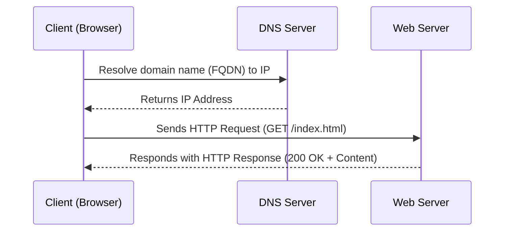

## Table of Contents

- [1. HTTP](#1-http)
- [2. HTTPS](#2-https)
- [3. HTTP requests and responses](#3-http-requests-and-responses)
- [4. HTTP Headers](#4-http-headers)
- [5. HTTP methods and codes](#5-http-methods-and-codes)
- [6. GET](#6-get)
- [7. POST](#7-post)
- [8. CRUD API](#8-crud-api)

## 1. HTTP

A **web request** is a request made by a **client**, such as a **web browser**, to a **server** in order to retrieve a **web page** or other **resource**. Web requests are sent using the **Hypertext Transfer Protocol (`HTTP`)**, which is a standard protocol for transmitting data on the **World Wide Web**.  

**`HTTP` communication** consists of a **client** and a **server**, where the **client** requests the **server** for a **resource**. The **server** processes the requests and returns the requested **resource**.  



More about **`HTTP`**:  
> 1. Most **internet communications** are made with **web requests** through the **`HTTP` protocol**.  
> 2. It is an **application-level protocol** used to access the **World Wide Web resources**.  
> 3. The term **hypertext** stands for text containing **links** to other **resources** and text that the readers can easily interpret.  
> 4. Default **port** for **`HTTP` communication** is **port `80`** (this can be changed to any other port, depending on the **web server configuration**).  

## 2. URL

Resources over HTTP are accessed via a URL (Uniform Resource Locator)


| Component   | Example                  | Description |
|------------|--------------------------|-------------|
| **Scheme**  | `http://`, `https://`    | Identifies the protocol, ends with `://`. |
| **User Info** | `admin:password@`      | Optional credentials, separated from the host by `@`. |
| **Host**    | `inlanefreight.com`      | Resource location (can be a hostname or IP). |
| **Port**    | `:80`                    | Defaults: `80` for HTTP, `443` for HTTPS. |
| **Path**    | `/dashboard.php`         | Points to a file or folder. If no path specified, server returns the default index |
| **Query String** | `?login=true`       | Starts with `?`, contains key-value pairs. |
| **Fragments** | `#status`              | Used by browsers to locate sections. |


> **Notice:**  
> - Not all components are required to access a resource.  
> - **Scheme** and **Host** are mandatory.  
> - Default, HTTP use port `80` and HTTPS use port `443`.
> - The query string starts with a “?”. It includes parameters and values. Parameters are separated by an & symbol.
> - In a URL, there can be many parameters, each parameter can have many different values.
> - 
> - In the above example, the first parameter is ``brands``, and has the value ``1146267,1073549,4119060,1068790``, separated by a space ``%2``. The second parameter is: ``keyword`` with the value ``backpack``, …
> - However, the length of a URL is usually limited by: Web browser, web server, and/or web applications to ensure performance, compatibility, and
security.

---

**Extend notice (about url, uri, urn):**

| Term  | Full Form                     | Purpose                                           | Example |
|-------|--------------------------------|---------------------------------------------------|---------|
| **URI** | Uniform Resource Identifier  | Generic identifier for a resource (name or location). | `https://example.com/index.html` (URL) <br> `urn:isbn:0451450523` (URN) |
| **URL** | Uniform Resource Locator     | Specifies the **location** of a resource and how to access it. | `https://www.example.com/index.html` |
| **URN** | Uniform Resource Name        | Uniquely **names** a resource without specifying its location. | `urn:isbn:0451450523` (Book ISBN) |


**Relationship**
- **A URL is a type of URI** that provides a location.  
- **A URN is a type of URI** that provides a unique name but no location.  
- A URI can be either a URL, a URN, or both, **But NOT BACKWARD.**  

---

`cURL` (client URL) is a command-line tool and library that primarily supports HTTP along with many other protocols.

**Curl Command Help**:

```bash
$ curl -h
Usage: curl [options...] <url>
 -d, --data <data>         HTTP POST data
 -h, --help <category>     Get help for commands
 -i, --include            Include protocol response headers in the output
 -o, --output <file>      Write to file instead of stdout
 -O, --remote-name        Write output to a file named as the remote file
 -s, --silent             Silent mode
 -u, --user <user:password> Server user and password
 -A, --user-agent <name>  Send User-Agent <name> to server
 -v, --verbose            Make the operation more talkative

```

## 3. HTTP requests and responses
...

## 4. HTTP Headers
...

## 5. HTTP methods and codes
...

## 6. GET
...

## 7. POST
...

## 8. CRUD API
...
