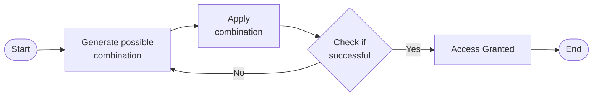

# 1. Basics

The success of a brute force attack depends on several factors, including:
- The `complexity` of the password or key. Longer passwords with a mix of uppercase and lowercase letters, numbers, and symbols are exponentially more complex to crack.
- The `computational power` available to the attacker. Modern computers and specialized hardware can try billions of combinations per second, significantly reducing the time needed for a successful attack.
- The `security measures` in place. Account lockouts, CAPTCHAs, and other defenses can slow down or even thwart brute-force attempts.


## How it works



1. **`Start`**: The attacker initiates the brute force process, often with the aid of specialized software.
2. **`Generate Possible Combination`**: The software generates a potential password or key combination based on predefined parameters, such as character sets and length.
3. **`Apply Combination`**: The generated combination is attempted against the target system, such as a login form or encrypted file.
4. **`Check if Successful`**: The system evaluates the attempted combination. If it matches the stored password or key, access is granted. Otherwise, the process continues.
5. **`Access Granted`**: The attacker gains unauthorized access to the system or data.
6. **`End`**: The process repeats, generating and testing new combinations until either the correct one is found or the attacker gives up.

## Types of Brute Forcing

|Method|	Description|	Example|	Best Used When...|
|-|-|-|-|
|**`Simple Brute Force`**|Systematically tries all possible combinations of characters within a defined character set and length range.|Trying all combinations of lowercase letters from 'a' to 'z' for passwords of length 4 to 6.|No prior information about the password is available, and computational resources are abundant.|
|**`Dictionary Attack`**|Uses a pre-compiled list of common words, phrases, and passwords.|Trying passwords from a list like 'rockyou.txt' against a login form.|The target will likely use a weak or easily guessable password based on common patterns.|
|**`Hybrid Attack`**|Combines elements of simple brute force and dictionary attacks, often appending or prepending characters to dictionary words.|Adding numbers or special characters to the end of words from a dictionary list.|The target might use a slightly modified version of a common password.|
|**`Credential Stuffing`**|	Leverages leaked credentials from one service to attempt access to other services, assuming users reuse passwords.|	Using a list of usernames and passwords leaked from a data breach to try logging into various online accounts.|	A large set of leaked credentials is available, and the target is suspected of reusing passwords across multiple services.|
|**`Password Spraying`**|	Attempts a small set of commonly used passwords against a large number of usernames.|	Trying passwords like 'password123' or 'qwerty' against all usernames in an organization.|	Account lockout policies are in place, and the attacker aims to avoid detection by spreading attempts across multiple accounts.|
|**`Rainbow Table Attack`**|	Uses pre-computed tables of password hashes to reverse hashes and recover plaintext passwords quickly.|	Pre-computing hashes for all possible passwords of a certain length and character set, then comparing captured hashes against the table to find matches.|	A large number of password hashes need to be cracked, and storage space for the rainbow tables is available.|
|**`Reverse Brute Force`**|	Targets a single password against multiple usernames, often used in conjunction with credential stuffing attacks.|	Using a leaked password from one service to try logging into multiple accounts with different usernames.|	A strong suspicion exists that a particular password is being reused across multiple accounts.|
|**`Distributed Brute Force`**|	Distributes the brute forcing workload across multiple computers or devices to accelerate the process.|	Using a cluster of computers to perform a brute-force attack significantly increases the number of combinations that can be tried per second.|	The target password or key is highly complex, and a single machine lacks the computational power to crack it within a reasonable timeframe.|

## The Role of Brute Forcing in Penetration Testing

While penetration tests encompass a range of techniques, brute forcing is often strategically employed when:
- **`Other avenues are exhausted`**: Initial attempts to gain access, such as exploiting known vulnerabilities or utilizing social engineering tactics, may prove unsuccessful. In such scenarios, brute forcing is a viable alternative to overcome password barriers.
- **`Password policies are weak`**: If the target system employs lax password policies, it increases the likelihood of users having weak or easily guessable passwords. Brute forcing can effectively expose these vulnerabilities.
- **`Specific accounts are targeted`**: In some instances, penetration testers may focus on compromising specific user accounts, such as those with elevated privileges. Brute forcing can be tailored to target these accounts directly.

## The Perils of Default Credentials

| Device/Manufacturer     | Default Username | Default Password | Device Type                     |
|--------------------------|------------------|-------------------|----------------------------------|
| Linksys Router           | admin            | admin             | Wireless Router                 |
| D-Link Router            | admin            | admin             | Wireless Router                 |
| Netgear Router           | admin            | password          | Wireless Router                 |
| TP-Link Router           | admin            | admin             | Wireless Router                 |
| Cisco Router             | cisco            | cisco             | Network Router                  |
| Asus Router              | admin            | admin             | Wireless Router                 |
| Belkin Router            | admin            | password          | Wireless Router                 |
| Zyxel Router             | admin            | 1234              | Wireless Router                 |
| Samsung SmartCam         | admin            | 4321              | IP Camera                       |
| Hikvision DVR            | admin            | 12345             | Digital Video Recorder (DVR)    |
| Axis IP Camera           | root             | pass              | IP Camera                       |
| Ubiquiti UniFi AP        | ubnt             | ubnt              | Wireless Access Point           |
| Canon Printer            | admin            | admin             | Network Printer                 |
| Honeywell Thermostat     | admin            | 1234              | Smart Thermostat                |
| Panasonic DVR            | admin            | 12345             | Digital Video Recorder (DVR)    |

# 2. Hydra

Hydra is a fast network login cracker that supports numerous attack protocols. It is a versatile tool that can brute-force a wide range of services, including web applications, remote login services like SSH and FTP, and even databases.

Hydra's popularity stems from its:
- **Speed and Efficiency**: Hydra utilizes parallel connections to perform multiple login attempts simultaneously, significantly speeding up the cracking process.
- **Flexibility**: Hydra supports many protocols and services, making it adaptable to various attack scenarios.
- **Ease of Use**: Hydra is relatively easy to use despite its power, with a straightforward command-line interface and clear syntax.

## Basic Usage

```

$ hydra [login_options] [password_options] [attack_options] [service_options]

```

| Parameter              | Explanation                                                                                   | Usage Example                                                                                      |
|------------------------|-----------------------------------------------------------------------------------------------|------------------------------------------------------------------------------------------------------|
| `-l LOGIN` or `-L FILE` | Login options: Specify either a single username (`-l`) or a file containing a list (`-L`).   | `hydra -l admin ...` or `hydra -L usernames.txt ...`                                                |
| `-p PASS` or `-P FILE` | Password options: Provide either a single password (`-p`) or a file of passwords (`-P`).      | `hydra -p password123 ...` or `hydra -P passwords.txt ...`                                          |
| `-t TASKS`             | Tasks: Define the number of parallel tasks (threads) to run.                                  | `hydra -t 4 ...`                                                                                     |
| `-f`                   | Fast mode: Stop the attack after the first successful login is found.                         | `hydra -f ...`                                                                                       |
| `-s PORT`              | Port: Specify a non-default port for the target service.                                      | `hydra -s 2222 ...`                                                                                  |
| `-v` or `-V`           | Verbose output: Display detailed information about the attack's progress.                    | `hydra -v ...` or `hydra -V ...` (for even more verbosity)                                           |
| `service://server`     | Target: Specify the service (e.g., `ssh`, `http`, `ftp`) and the server's address/hostname.   | `hydra ssh://192.168.1.100`                                                                         |
| `/OPT`                 | Service-specific options: Provide any additional options required by the target service.      | `hydra http-get://example.com/login.php -m "POST:user=^USER^&pass=^PASS^"` (for HTTP form login)    |


## Hydra Services

|Hydra Service|	Service/Protocol	|Description|	Example Command|
|-|-|-|-|
|`ftp`|	File Transfer Protocol (FTP)|	Used to brute-force login credentials for FTP services, commonly used to transfer files over a network.|	`hydra -l admin -P /path/to/password_list.txt ftp://192.168.1.100`|
|`ssh`	|Secure Shell (SSH)	|Targets SSH services to brute-force credentials, commonly used for secure remote login to systems.	|`hydra -l root -P /path/to/password_list.txt ssh://192.168.1.100`|
|`http-get/post`	|HTTP Web Services	|Used to brute-force login credentials for HTTP web login forms using either GET or POST requests.	|`hydra -l admin -P /path/to/password_list.txt http-post-form "/login.php:user=^USER^&pass=^PASS^:F=incorrect"`|
|`smtp`	|Simple Mail Transfer Protocol	|Attacks email servers by brute-forcing login credentials for SMTP, commonly used to send emails.	|`hydra -l admin -P /path/to/password_list.txt smtp://mail.server.com`|
|`pop3`|	Post Office Protocol (POP3)	|Targets email retrieval services to brute-force credentials for POP3 login.	|`hydra -l user@example.com -P /path/to/password_list.txt pop3://mail.server.com`|
|`imap`	|Internet Message Access Protocol	|Used to brute-force credentials for IMAP services, which allow users to access their email remotely.	|`hydra -l user@example.com -P /path/to/password_list.txt imap://mail.server.com`|
|`mysql`|	MySQL Database	|Attempts to brute-force login credentials for MySQL databases.	|`hydra -l root -P /path/to/password_list.txt mysql://192.168.1.100`|
|`mssql`	|Microsoft SQL Server	|Targets Microsoft SQL servers to brute-force database login credentials.	|`hydra -l sa -P /path/to/password_list.txt mssql://192.168.1.100`|
|`vnc`|	Virtual Network Computing (VNC)|	Brute-forces VNC services, used for remote desktop access.	|`hydra -P /path/to/password_list.txt vnc://192.168.1.100`|
|`rdp`	|Remote Desktop Protocol (RDP)	|Targets Microsoft RDP services for remote login brute-forcing.	|`hydra -l admin -P /path/to/password_list.txt rdp://192.168.1.100`|

## Brute-Forcing HTTP Authentication

To test a website's HTTP authentication security at `www.example.com` using username and password lists:

```shell-session
$ hydra -L usernames.txt -P passwords.txt www.example.com http-get
```

This command:
- Uses usernames from `usernames.txt`
- Tests passwords from `passwords.txt`
- Targets `www.example.com`
- Uses `http-get` module for HTTP authentication testing

Hydra will try all username-password combinations to find valid credentials.

## Targeting Multiple SSH Servers

To test multiple servers for SSH brute-force vulnerability:

```shell-session
$ hydra -l root -p toor -M targets.txt ssh
```

This command:
- Tests single username "root"
- Uses password "toor"
- Targets all servers listed in `targets.txt`
- Employs the SSH module

Hydra performs parallel brute-force attempts on all servers, increasing efficiency.

## Testing FTP Credentials on a Non-Standard Port

To assess FTP server security at `ftp.example.com` on port 2121:

```shell-session
$ hydra -L usernames.txt -P passwords.txt -s 2121 -V ftp.example.com ftp
```

This command:
- Uses username list from `usernames.txt`
- Tests passwords from `passwords.txt`
- Specifies non-standard port 2121 with `-s`
- Enables verbose output with `-V`
- Targets the FTP service

Hydra will try all username-password combinations against the specified FTP server port.

## Brute-Forcing a Web Login Form

To brute-force a web application login form at `www.example.com`:

```shell-session
$ hydra -l admin -P passwords.txt www.example.com http-post-form "/login:user=^USER^&pass=^PASS^:S=302"
```

This command:
- Uses fixed username "admin"
- Tests passwords from `passwords.txt`
- Targets the `/login` path
- Uses `http-post-form` module with form parameters `user=^USER^&pass=^PASS^`
- Identifies success by HTTP 302 redirect status code

Hydra will try each password with the admin username, looking for successful logins.

## Advanced RDP Brute-Forcing

To test a Remote Desktop Protocol service with custom password parameters:

```shell-session
$ hydra -l administrator -x 6:8:abcdefghijklmnopqrstuvwxyzABCDEFGHIJKLMNOPQRSTUVWXYZ0123456789 192.168.1.100 rdp
```

This command:
- Uses fixed username "administrator"
- Generates passwords with length 6-8 characters
- Uses character set including lowercase, uppercase, and numbers
- Targets IP address 192.168.1.100
- Employs the RDP module

Hydra will systematically test all possible password combinations within these parameters.


