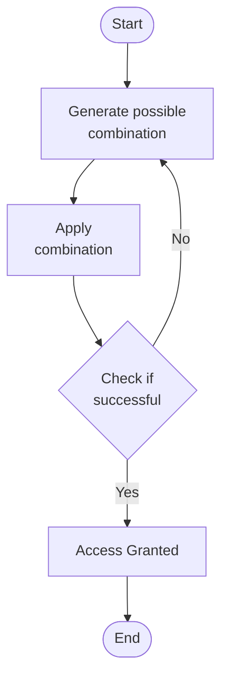

# 1. Basics

The success of a brute force attack depends on several factors, including:
- The `complexity` of the password or key. Longer passwords with a mix of uppercase and lowercase letters, numbers, and symbols are exponentially more complex to crack.
- The `computational power` available to the attacker. Modern computers and specialized hardware can try billions of combinations per second, significantly reducing the time needed for a successful attack.
- The `security measures` in place. Account lockouts, CAPTCHAs, and other defenses can slow down or even thwart brute-force attempts.

## How it works

1. **`Start`**: The attacker initiates the brute force process, often with the aid of specialized software.
2. **`Generate Possible Combination`**: The software generates a potential password or key combination based on predefined parameters, such as character sets and length.
3. **`Apply Combination`**: The generated combination is attempted against the target system, such as a login form or encrypted file.
4. **`Check if Successful`**: The system evaluates the attempted combination. If it matches the stored password or key, access is granted. Otherwise, the process continues.
5. **`Access Granted`**: The attacker gains unauthorized access to the system or data.
6. **`End`**: The process repeats, generating and testing new combinations until either the correct one is found or the attacker gives up.

