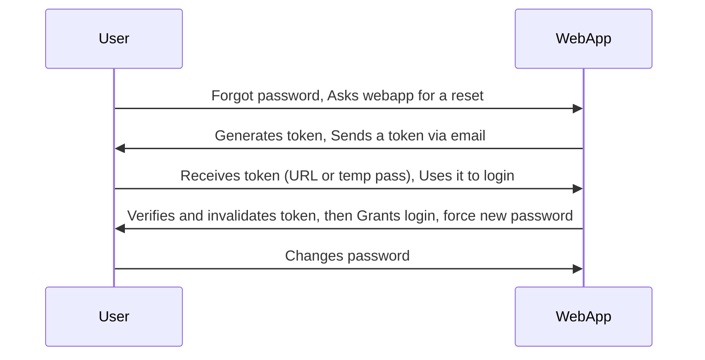

# 1. The basics

| **Authentication** | **Authorization** |
|---------------------|--------------------|
| ✅ Determines whether users are who they claim to be | ✅ Determines what users can and cannot access |
| ✅ Challenges the user to validate credentials (for example, through passwords, answers to security questions, or facial recognition) | ✅ Verifies whether access is allowed through policies and rules |
| ✅ Usually done before authorization | ✅ Usually done after successful authentication |
| ✅ It usually needs the user’s login details | ✅ While it needs user’s privilege or security levels |
| ✅ Generally, transmits info through an **ID Token** | ✅ Generally, transmits info through an **Access Token** |


## Common Authentication Methods

Information technology systems can implement different authentication methods. Typically, they can be divided into the following three major categories:

- `Knowledge-based authentication` (something that the user knows to prove their identity, such as passwords, passphrases, PINs, or answers to security questions.)
- `Ownership-based authentication` (relies on something the user possesses. Such as ID cards, security tokens, or smartphones with authentication apps.) 
- `Inherence-based authentication` (relies on something the user is or does. This includes biometric factors such as fingerprints, facial patterns, and voice recognition, or signatures.)

|Knowledge	|Ownership	|Inherence|
|-|-|-|
|Password|	ID card	|Fingerprint|
|PIN|	Security Token	|Facial Pattern|
|Answer to Security Question|	Authenticator App|	Voice Recognition|

**Attacking Knowledge-based Authentication**

`Knowledge-based authentication` is widespread and **vulnerable to attack**. This module focuses primarily on this method due to its exploitable weaknesses. It relies on **static personal information** that attackers can obtain through `guessing`, `brute-force attacks`, `social engineering`, or `data breaches`. As **cyber threats** evolve, attackers increasingly exploit these **authentication weaknesses**.

**Attacking `Ownership-based Authentication`**

`Ownership-based authentication` offers **significant advantages** against common threats like `phishing` or `password-guessing attacks`. **Physical tokens** and `smart cards` are inherently more secure since physical items are harder to acquire or replicate than information obtained through `data breaches`. However, **cost and logistics** of distributing physical devices can limit widespread adoption.

These systems remain vulnerable to **physical attacks** like `stealing` or `cloning`, and **cryptographic attacks** on underlying algorithms. For example, `cloning NFC badges` in public places is a feasible attack vector.

**Attacking `Inherence-based Authentication`**

`Inherence-based authentication` provides **convenience** and **user-friendliness** by eliminating the need for complex passwords or physical tokens. Users simply provide `biometric data` like `fingerprints` or `facial scans`. This enhances **user experience** and reduces security breaches from weak passwords.

However, these systems face **irreversible compromise** risks during data breaches since users cannot change `biometric features`. A notable 2019 breach of a biometric smart lock company exposed all `fingerprints`, `facial patterns`, usernames, passwords, and user addresses. Unlike knowledge-based systems where users could change passwords, the **biometric data compromise** was permanent.

## How do authentication vulnerabilities arise?

Most vulnerabilities in **authentication mechanisms** occur in two ways:

* **Weak mechanisms** that fail to protect against `brute-force attacks`
* **Logic flaws** or poor coding that allow attackers to bypass authentication entirely (**broken authentication**)

Since authentication is **critical to security**, flawed authentication logic typically exposes websites to significant **security issues**.

# 2. Brute-Force Attacks

## 2.1 - Enumerating Users

User enumeration is a common vulnerability that can `expose valid usernames` through `subtle differences` in application behavior—such as `error messages or response timing`.

```
$ ffuf -w xato-net-10-million-usernames.txt:FUZZ -u http://94.237.57.57:45375/index.php -X POST -H "Content-Type: application/x-www-form-urlencoded" -d "username=FUZZ&password=invalid" -fr "Unknown user" -v -c
```

## 2.2 - Brute-Forcing Passwords

Brute-forcing passwords is a common attack method that exploits weak or reused credentials, which are still widely used despite known risks.

For example, if we somehow can get the password policy from Information Disclosure, or somthing like error message when logging in:
- Password policy:
  + `contains at least 1 upper-case char`
  + `contains at least 1 lower-case char`
  + `contains at least 1 digit`
  + `minimum length of 10 chars`

We can try to cut those out of custom wordlist:

```
$ grep '[[:upper:]]' /opt/useful/seclists/Passwords/Leaked-Databases/rockyou.txt | grep '[[:lower:]]' | grep '[[:digit:]]' | grep -E '.{10}' > custom_wordlist.txt
$ wc -l custom_wordlist.txt

151647 custom_wordlist.txt
```

## 2.3 - Brute-Forcing Password Reset Tokens

Many web applications implement a password-recovery functionality if a user forgets their password. This password-recovery functionality typically relies on a one-time reset token, which is transmitted to the user, for instance, via SMS or E-Mail. The user can then authenticate using this token, enabling them to reset their password and access their account.

As such, a weak password-reset token may be brute-forced or predicted by an attacker to take over a victim's account.

Reset tokens (in the form of a code or temporary password) are secret data generated by an application when a user requests a password reset. The user can then change their password by presenting the reset token.

Since password reset tokens enable an attacker to reset an account's password without knowledge of the password, they can be leveraged as an attack vector to take over a victim's account if implemented incorrectly. Password reset flows can be complicated because they consist of several sequential steps; a basic password reset flow is shown below:



To identify `weak reset tokens`, we typically need to create an account on the target web application, request a password reset token, and then analyze it. In this example, let us assume we have received the following password reset e-mail:

```
Hello,

We have received a request to reset the password associated with your account. To proceed with resetting your password, please follow the instructions below:

1. Click on the following link to reset your password: Click

2. If the above link doesn't work, copy and paste the following URL into your web browser: http://weak_reset.htb/reset_password.php?token=7351

Please note that this link will expire in 24 hours, so please complete the password reset process as soon as possible. If you did not request a password reset, please disregard this e-mail.

Thank you.
```

As we can see, the password reset link contains the reset token in the `GET-parameter token`. In this example, the token is 7351. Given that the token consists of only a `4-digit number`, there can be only 10,000 possible values. This allows us to hijack users' accounts by requesting a password reset and then brute-forcing the token.

We will use `ffuf` to brute-force all possible reset tokens. First, we need to create a wordlist of all possible tokens from `0000` to `9999`, which we can achieve with `seq`: `$ seq -w 0 9999 > tokens.txt`

## 2.4 - Brute-Forcing 2FA Codes

One common 2FA method combines a password with a time-based one-time password (TOTP) sent via authenticator app or SMS. Since TOTPs are typically only digits, they can be vulnerable to guessing attacks if they're too short or if the application doesn't prevent multiple failed attempts.

For example, we assume that we obtained valid credentials in a prior phishing attack: `admin:admin`. However, the web application is secured with `2FA` using OTP code, as we can see after logging in with the obtained credentials. 

From here, its only possible to fuzz with `ffuf` if: there is no `try limit` + `if we know the policy` (length, format, ...).

## 2.5 - Weak Brute-Force Protection

### Rate Limits

Rate limiting controls the number of requests to a system within a specified timeframe to prevent server overload, system downtime, and brute-force attacks. It maintains system stability and ensures fair resource usage by enforcing maximum request thresholds.

When attackers hit rate limits during brute-force attacks, the system either increases response times or temporarily blocks access. However, rate limits should only affect attackers, not legitimate users, to avoid creating denial-of-service scenarios.

Many implementations use IP addresses to identify attackers, but this becomes problematic with middleboxes like reverse proxies or load balancers, where the source IP belongs to the middlebox rather than the actual attacker. Some systems rely on HTTP headers like `X-Forwarded-For` to determine the real source IP.

This creates a vulnerability: attackers can set arbitrary HTTP headers, including randomizing `X-Forwarded-For` values in each request to bypass rate limits entirely. This type of vulnerability occurs frequently in real-world applications, as documented in cases like CVE-2020-35590.

### CAPTCHAs

CAPTCHA (Completely Automated Public Turing test to tell Computers and Humans Apart) is a security measure that prevents bots from submitting automated requests by requiring human interaction. CAPTCHAs present challenges easy for humans but difficult for bots, such as identifying distorted text, selecting objects in images, or solving simple puzzles.

By forcing manual completion of these challenges, CAPTCHAs make brute-force attacks infeasible since they become manual tasks rather than automated scripts. This helps prevent spam, fake account creation, and login attacks.

Additionally, tools and browser extensions to solve CAPTCHAs automatically are rising. Many open-source CAPTCHA solvers can be found. In particular, the rise of AI-driven tools provides CAPTCHA-solving capabilities by utilizing powerful image recognition or voice recognition machine learning models.

## 2.6 - Default Credentials

Many web applications are set up with default credentials to allow accessing it after installation. However, these credentials need to be changed after the initial setup of the web application; otherwise, they provide an easy way for attackers to obtain authenticated access. As such, Testing for Default Credentials is an essential part of authentication testing in OWASP's Web Application Security Testing Guide.

Many platforms provide lists of default credentials for a wide variety of web applications. Such an example is the web database maintained by [CIRT.net](https://www.cirt.net/passwords). Further resources include SecLists Default Credentials as well as the SCADA GitHub repository which contains a list of default passwords for a variety of different vendors.

## 2.7 - Vulnerable Password Reset

### Guessable Password Reset Questions

Web applications often use security questions to authenticate users during password resets. Users typically answer predefined, generic questions during registration rather than creating custom ones, meaning all users face identical security questions that attackers can exploit.

The main vulnerability lies in the predictability of answers to common questions like:
* "What is your mother's maiden name?"
* "What city were you born in?"

While these appear personal, answers can often be discovered through OSINT (Open Source Intelligence) gathering or guessed through brute-force attacks if the system lacks proper protection. This makes question-based password reset functionality a weak authentication method that attackers can readily abuse.

For instance, assuming a web application uses a security question like `What city were you born in?`. We can attempt to `brute-force` the answer to this question by using a proper wordlist. There are multiple lists containing large cities in the world. Thus, if we knew that our target user was from Germany, we could create a wordlist containing only German cities, reducing the number

```
$ cat world-cities.csv | cut -d ',' -f1 > city_wordlist.txt

$ wc -l city_wordlist.txt 

26468 city_wordlist.txt

$cat world-cities.csv | grep Germany | cut -d ',' -f1 > german_cities.txt

$ wc -l german_cities.txt 

1117 german_cities.txt

$ ffuf -w ./city_wordlist.txt -u http://pwreset.htb/security_question.php -X POST -H "Content-Type: application/x-www-form-urlencoded" -b "PHPSESSID=39b54j201u3rhu4tab1pvdb4pv" -d "security_response=FUZZ" -fr "Incorrect response."

<SNIP>

[Status: 302, Size: 0, Words: 1, Lines: 1, Duration: 0ms]
    * FUZZ: Houston
```

### Manipulating the Reset Request

Another instance of a flawed password reset logic occurs when a user can manipulate a potentially `hidden parameter` to reset the password of a different account.

For instance, we use a test account to reset its password, the website could ask us to specify `username`. We submit our test account so:

```
POST /reset.php HTTP/1.1
Host: pwreset.htb
Content-Length: 18
Content-Type: application/x-www-form-urlencoded
Cookie: PHPSESSID=39b54j201u3rhu4tab1pvdb4pv

username=htb-stdnt
```

From here, we will do some formal procedure to reset our password. However, use `intercept tools` along the process, at the last momment we enter our `new password`:

```
POST /reset_password.php HTTP/1.1
Host: pwreset.htb
Content-Length: 36
Content-Type: application/x-www-form-urlencoded
Cookie: PHPSESSID=39b54j201u3rhu4tab1pvdb4pv

password=P@$$w0rd&username=htb-stdnt
```

If the website behave like so, by intercepting, we can alter the username to `admin` or so.

# 3. Authentication Bypass

### Direct Access


