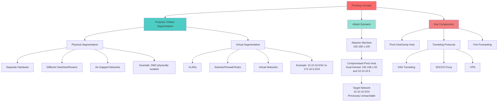

# Table of Contents

- [1. Intro and concept](#1-intro-and-concept)
  - [1.1 - What, Why, When](#11---what-why-when)
  - [1.2 - Concept](#12---concept)
- [2. The Networking Behind Pivoting](#2-the-networking-behind-pivoting)
  - [2.1 - IP Addressing & NICs](#21---ip-addressing--nics)
  - [2.2 - Routing](#22---routing)
  - [2.3 - Protocols, Services & Ports](#23---protocols-services--ports)

---

# 1. Intro and concept

## 1.1 - What, Why, When



During security assessments, you may compromise `credentials`, `ssh keys`, `hashes`, or `access tokens` for a target host that's not directly reachable from your attack machine. In such cases, use a `pivot host` (an already compromised system) as a bridge to reach your next target. 

When first accessing a host, check `privilege level`, `network connections`, and `VPN or remote access software`. Hosts with multiple network adapters can access different network segments. **Pivoting** means `moving to other networks through a compromised host to find more targets on different network segments`.

**Common terms for pivot hosts:**
* Pivot Host
* Proxy
* Foothold
* Beach Head system
* Jump Host

**Pivoting** defeats network segmentation (physical and virtual) to access isolated networks. Network Segmentation Explanation:

- **Physical Segmentation**:

  * Separate physical networks with different switches, routers, or air-gapped systems
  * Example: Corporate network on one floor, server network on another floor with different hardware
  * Think of it as completely separate buildings with their own infrastructure

- **Virtual Segmentation**:

  * Logical separation using VLANs, subnets, firewall rules, or virtualization
  * Example: VLAN 10 for employees, VLAN 20 for servers - same physical switch but logically isolated
  * Think of it as different apartments in the same building - shared infrastructure but separated by rules

**Tunneling** is a subset of pivoting that encapsulates network traffic into another protocol to hide it. VPNs and specialized browsers work similarly—they tunnel network traffic inside another protocol to obscure it.

---

## 1.2 - Concept

**Lateral Movement vs. Pivoting vs. Tunneling**

These terms are often confused but describe different concepts:

**Lateral Movement**
Spreading access to additional hosts, applications, and services within a network to gain resources and elevate privileges.

*Example:* Compromised a local administrator account, found it was shared across multiple Windows hosts, and used those credentials to access other systems and further compromise the domain.

**Pivoting**
Using multiple hosts to cross network boundaries you normally can't access. A targeted objective to move deeper into networks by compromising specific hosts or infrastructure.

*Example:* Target network was physically/logically separated. We compromised a dual-homed engineering workstation (multiple NICs on different networks) that had access to both enterprise and operational environments, allowing us to pivot between isolated networks.

**Tunneling**
Shuttling traffic in/out of a network using various protocols to avoid detection. Obfuscating actions by hiding traffic inside protocols like HTTP/HTTPS or SSH to maintain Command & Control (C2) and exfiltrate data.

*Example:* Masked C2 traffic inside normal-looking HTTP GET/POST requests. Properly formed packets reached our control server; malformed ones redirected elsewhere to throw off defenders.

**Summary:** Lateral Movement spreads wide within a network for privilege escalation. Pivoting goes deeper to access previously unreachable environments. Tunneling hides traffic to avoid detection.

**For further explains and references (Highly recommended):**
- [Palo Alto Network's Explanation](https://www.paloaltonetworks.com/cyberpedia/what-is-lateral-movement#technicques)
- [MITRE's Explanation](https://attack.mitre.org/tactics/TA0008/)

---

# 2. The Networking Behind Pivoting

---

## 2.1 - IP Addressing & NICs

Every computer on a network needs an IP address, assigned to a Network Interface Controller (NIC). IP addresses can be assigned dynamically (DHCP) or statically. Static IPs are common for servers, routers, switches, printers, and critical services.

Computers can have multiple NICs (physical/virtual) with multiple IP addresses, allowing communication across various networks. **Identifying pivoting opportunities depends on discovering these additional NICs and their assigned IPs**, as they reveal which networks a compromised host can reach.

**Check NICs using:**
- Linux/macOS: `ifconfig`
- Windows: `ipconfig`

**Key Information from ifconfig/ipconfig:**

*Example output show the result of checking NICs:*
- **eth0**: Public IP (134.122.100.200) - Internet-facing, commonly in DMZs
- **eth1**: Private IP (10.106.0.172) - Internal network only
- **tun0**: VPN tunnel interface (10.10.15.54) - Encrypted connection to private networks
- **lo**: Loopback (127.0.0.1)

**Important Concepts:**
- **Public IPs**: Routable over the Internet by ISPs
- **Private IPs**: Routable only within internal networks, not over the Internet
- **Subnet Mask**: Defines network vs. host portion of an IP (like an area code for phone numbers)
- **Default Gateway**: Router IP that forwards traffic to other networks

**For Pivoting:** Document all IP addressing information on compromised hosts to understand which networks they can reach. Hosts with multiple NICs are prime pivoting candidates.

---

## 2.2 - Routing

Any computer can technically become a router. In pivoting, we often make a pivot host route traffic to another network using tools like **AutoRoute**, which allows our attack box to reach target networks through the pivot host.

**Key characteristic of a router:** It has a routing table that forwards traffic based on destination IP addresses.

**Check routing table using:**
- Linux: `netstat -r` or `ip route`
- Windows: `route print`

**Example Routing Table:**
```
Destination     Gateway         Genmask         Iface
default         178.62.64.1     0.0.0.0         eth0
10.10.10.0      10.10.14.1      255.255.254.0   tun0
10.129.0.0      10.10.14.1      255.255.0.0     tun0
178.62.64.0     0.0.0.0         255.255.192.0   eth0
```

**How it works:**
- When sending a packet (e.g., to 10.129.10.25), the routing table determines which Gateway and NIC (Iface) to use
- Routes are learned through: directly connected interfaces, static routes, or dynamic routing protocols (EIGRP, OSPF, BGP)
- Traffic for networks not in the table goes to the **default route** (default gateway/gateway of last resort)

**For Pivoting:** Examine the routing table on compromised hosts to identify reachable networks or routes that need to be added.

---


## 2.3 - Protocols, Services & Ports

**Protocols** are rules governing network communications. **Ports** are software-assigned identifiers for applications (not physical connections).

**Key Concepts:**
- **IP address** identifies a computer on a network
- **Open port** identifies an application you can connect to
- **Listening port** means the application is accepting connections

**Pivoting Strategy:**
Connect to ports that are **permitted through firewalls** to gain a foothold.

*Example:* A web server listening on port 80 (HTTP) cannot have inbound traffic blocked, or visitors couldn't access the website. Attackers can use this same permitted port to gain entry—**legitimate traffic provides cover**.

**Important Considerations:**
- **Source ports** track established connections on the client-side
- Be mindful of which ports you use when executing payloads
- Ensure payloads connect back to your intended listeners
- Get creative with port usage to bypass restrictions

---


