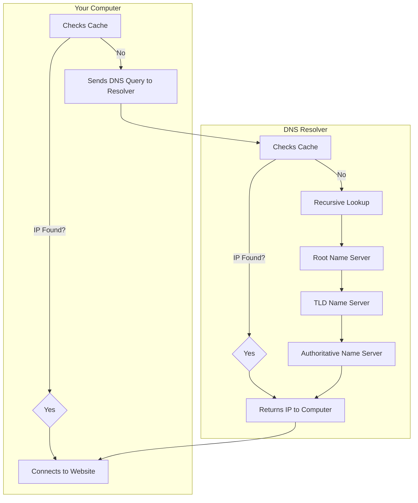
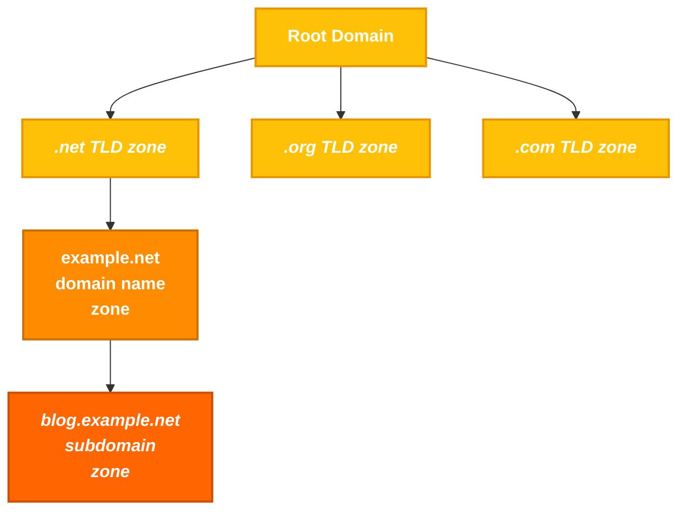

- [2. DNS](#2-dns)
- [3. The Hosts File](#3-the-hosts-file)


## 1. WHOIS

**WHOIS**:
> - Is a Query and response protocol.
> - Designed to access databases that store information about registered Internet resources.
> - Primarily related to domain names, can provide detailed information about IP address blocks and autonomous systems.
> - Allows for looking up who owns or is responsible for various online properties.

```bash
$ whois inlanefreight.com

[...]
Domain Name: inlanefreight.com
Registry Domain ID: 2420436757_DOMAIN_COM-VRSN
Registrar WHOIS Server: whois.registrar.amazon
Registrar URL: https://registrar.amazon.com
Updated Date: 2023-07-03T01:11:15Z
Creation Date: 2019-08-05T22:43:09Z
[...]
```

Each WHOIS `record` typically contains the following information:
- **Domain Name**: The domain name itself (e.g., example.com)
- **Registrar**: The company where the domain was registered (e.g., GoDaddy, Namecheap)
- **Registrant Contact**: The person or organization that registered the domain.
- **Administrative Contact**: The person responsible for managing the domain.
- **Technical Contact**: The person handling technical issues related to the domain.
- **Creation and Expiration Dates**: When the domain was registered and when it's set to expire.
- **Name Servers**: Servers that translate the domain name into an IP address.

**Note:** WHOIS can offers valuable insights into the target organisation's digital footprint and potential vulnerabilities:
> - **Identifying Key Personnel**: WHOIS records often reveal the `names`, `email addresses`, and `phone numbers` of **individuals responsible for managing the domain**. This information can be leveraged for social engineering attacks or to identify potential targets for phishing campaigns.
> - **Discovering Network Infrastructure**: Technical details like `name servers` and `IP addresses` provide clues about the target's **network infrastructure**. This can help penetration testers identify potential entry points or misconfigurations.
> - **Historical Data Analysis**: Accessing **historical WHOIS records** through services like **WhoisFreaks** can reveal changes in `ownership`, `contact information`, or `technical details` over time. This can be useful for tracking the evolution of the target's digital presence.

### Illustrate the value of WHOIS data:

**Scenario 1: Phishing Investigation**  

An email security gateway flags a suspicious email sent to multiple employees within a company. The email claims to be from the company's bank and urges recipients to click on a link to update their account information. A security analyst investigates the email and begins by performing a WHOIS lookup on the domain linked in the email.  

**The WHOIS record reveals the following:**

```bash

- Registration Date: The domain was registered just a few days ago.  
- Registrant: The registrant's information is hidden behind a privacy service.  
- Name Servers: The name servers are associated with a known bulletproof hosting provider often used for malicious activities.  

```
This combination of factors raises significant red flags for the analyst. The recent registration date, hidden registrant information, and suspicious hosting strongly suggest a phishing campaign. The analyst promptly alerts the company's IT department to block the domain and warns employees about the scam.  

Further investigation into the hosting provider and associated IP addresses may uncover additional phishing domains or infrastructure the threat actor uses.  


**Scenario 2: Malware Analysis**

A security researcher is analyzing a new strain of malware that has infected several systems within a network. The malware communicates with a remote server to receive commands and exfiltrate stolen data. To gain insights into the threat actor's infrastructure, the researcher performs a WHOIS lookup on the domain associated with the command-and-control (C2) server.  

**The WHOIS record reveals:**

```bash

- Registrant: The domain is registered to an individual using a free email service known for anonymity.  
- Location: The registrant's address is in a country with a high prevalence of cybercrime.  
- Registrar: The domain was registered through a registrar with a history of lax abuse policies.  

```

Based on this information, the researcher concludes that the C2 server is likely hosted on a compromised or "bulletproof" server. The researcher then uses the WHOIS data to identify the hosting provider and notify them of the malicious activity.  


**Scenario 3: Threat Intelligence Report**  

A cybersecurity firm tracks the activities of a sophisticated threat actor group known for targeting financial institutions. Analysts gather WHOIS data on multiple domains associated with the group's past campaigns to compile a comprehensive threat intelligence report.  

**By analyzing the WHOIS records, analysts uncover the following patterns:**

```bash

- Registration Dates: The domains were registered in clusters, often shortly before major attacks.  
- Registrants: The registrants use various aliases and fake identities.  
- Name Servers: The domains often share the same name servers, suggesting a common infrastructure.  
- Takedown History: Many domains have been taken down after attacks, indicating previous law enforcement or security interventions.  

```

These insights allow analysts to create a detailed profile of the threat actor's tactics, techniques, and procedures (TTPs). The report includes indicators of compromise (IOCs) based on the WHOIS data, which other organizations can use to detect and block future attacks.  

---

## 2. DNS

### Basic  understanding

DNS (Domain Name System) acts like the **GPS of the Internet**, translating domain names into IP addresses to enable efficient online navigation. It quickly retrieves the IP address when a domain name is entered into a browser.  

### How DNS Works:  

1. When a user enters a **domain name**, the **PC checks its cache** to see if it has previously accessed and stored the domain's IP address.  
   - If the IP address is found, the PC sends the request directly.  
   - If not, it connects to a **DNS resolver** provided by the ISP.  

2. The **DNS resolver** also checks its cache.  
   - If the IP is found, it returns it to the PC.  
   - Otherwise, it forwards the request to a **Root Name Server**.  

3. The **Root Name Server** does not store specific IP addresses. Instead, it directs the resolver to the **Top-Level Domain (TLD) Name Server** (e.g., `.com`, `.org`).  

4. The **TLD Name Server** helps narrow down the search.  
   - It identifies which **Authoritative Name Server** holds the IP for the requested domain and directs the resolver there.  

5. The **Authoritative Name Server** provides the correct IP address.  
   - This is the final stop, where the exact IP address is stored and returned to the resolver.  

6. The **DNS resolver** sends the IP address back to the **PC**, storing it in its cache for a certain period in case the user wants to revisit the website soon.  

7. The **user's PC** connects to the website using the retrieved IP address.  

### illustration on how it works:



### Key DNS concepts

In the Domain Name System (DNS), a `zone` is a distinct part of the domain namespace that a specific entity or administrator manages. Think of it as a virtual container for a set of domain names. For example, `example.com` and all its subdomains (like `mail.example.com` or `blog.example.com`) would typically belong to the same DNS zone.

A `zone` is a portion of the domain name space that an authoritative DNS server manages. A zone contains DNS records and helps determine how to resolve domain names to IP addresses.

**Note (Distinguishing Zone and Domain):**
> - Domain: The entire domain name space on the Internet (e.g. example.com).
> - Zone: A portion of a domain managed by a specific DNS server (e.g. sub.example.com could be a separate zone).



The `zone file`, a text file residing on a DNS server, defines the resource records (discussed below) within this zone, providing crucial information for translating domain names into IP addresses.

To illustrate, here's a simplified example of what a zone file, for example.com might look like:

```bash
$TTL 3600 ; Default Time-To-Live (1 hour)
@       IN SOA   ns1.example.com. admin.example.com. (
                2024060401 ; Serial number (YYYYMMDDNN)
                3600       ; Refresh interval
                900        ; Retry interval
                604800     ; Expire time
                86400 )    ; Minimum TTL

@       IN NS    ns1.example.com.
@       IN NS    ns2.example.com.
@       IN MX 10 mail.example.com.
www     IN A     192.0.2.1
mail    IN A     198.51.100.1
ftp     IN CNAME www.example.com.

```

This file defines the authoritative name servers (`NS records`), mail server (`MX record`), and IP addresses (`A records`) for various hosts within the **example.com** domain.

DNS servers store various `resource records`, each serving a specific purpose in the domain name resolution process. Some of them are:

| **DNS Concept**               | **Description**                                                                 | **Example** |
|--------------------------------|-----------------------------------------------------------------------------|------------|
| **Domain Name**                | A human-readable label for a website or other internet resource.           | [www.example.com](http://www.example.com) |
| **IP Address**                 | A unique numerical identifier assigned to each device connected to the internet. | `192.0.2.1` |
| **DNS Resolver**               | A server that translates domain names into IP addresses.                     | Your ISP's DNS server or public resolvers like Google DNS (`8.8.8.8`) |
| **Root Name Server**           | The top-level servers in the DNS hierarchy.                                  | There are 13 root servers worldwide, named A-M: `a.root-servers.net` |
| **TLD Name Server**            | Servers responsible for specific top-level domains (e.g., .com, .org).       | Verisign for **.com**, PIR for **.org** |
| **Authoritative Name Server**  | The server that holds the actual IP address for a domain.                    | Often managed by hosting providers or domain registrars. |
| **DNS Record Types**           | Different types of information stored in DNS.                                | `A, AAAA, CNAME, MX, NS, TXT`, etc. |


`Record` types and their purposes:

| **Record Type** | **Full Name**                 | **Description**                                                                 | **Zone File Example** |
|----------------|------------------------------|-----------------------------------------------------------------------------|---------------------|
| **A**         | Address Record                | Maps a hostname to its IPv4 address.                                       | `www.example.com. IN A 192.0.2.1` |
| **AAAA**      | IPv6 Address Record           | Maps a hostname to its IPv6 address.                                       | `www.example.com. IN AAAA 2001:db8:85a3::8a2e:370:7334` |
| **CNAME**     | Canonical Name Record         | Creates an alias for a hostname, pointing it to another hostname.         | `blog.example.com. IN CNAME webserver.example.net.` |
| **MX**        | Mail Exchange Record          | Specifies the mail server(s) responsible for handling email for the domain. | `example.com. IN MX 10 mail.example.com.` |
| **NS**        | Name Server Record            | Delegates a DNS zone to a specific authoritative name server.              | `example.com. IN NS ns1.example.com.` |
| **TXT**       | Text Record                   | Stores arbitrary text information, often used for domain verification or security policies. | `example.com. IN TXT "v=spf1 mx -all"` (SPF record) |
| **SOA**       | Start of Authority Record     | Specifies administrative information about a DNS zone, including the primary name server, responsible person's email, and other parameters. | `example.com. IN SOA ns1.example.com. admin.example.com. 2024060301 10800 3600 604800 86400` |
| **SRV**       | Service Record                | Defines the hostname and port number for specific services.                | `_sip._udp.example.com. IN SRV 10 5 5060 sipserver.example.com.` |
| **PTR**       | Pointer Record                | Used for reverse DNS lookups, mapping an IP address to a hostname.         | `1.2.0.192.in-addr.arpa. IN PTR www.example.com.` |

**Take away:**
> - **Uncovering Assets:** DNS records can reveal a wealth of information, including subdomains, mail servers, and name server records. For instance, a **CNAME record** pointing to an outdated server (`dev.example.com CNAME oldserver.example.net`) could lead to a vulnerable system.
> - **Mapping the Network Infrastructure:** You can create a comprehensive map of the target's network infrastructure by analyzing DNS data. For example, identifying the **name servers (NS records)** for a domain can reveal the hosting provider used, while an **A record** for `loadbalancer.example.com` can pinpoint a load balancer. This helps you understand **how different systems are connected, identify traffic flow, and pinpoint potential choke points or weaknesses** that could be exploited during a penetration test.
> - **Monitoring for Changes:** Continuously monitoring DNS records can reveal **changes in the target's infrastructure over time**. For example, the sudden appearance of a **new subdomain** (`vpn.example.com`) might indicate a **new entry point into the network**, while a **TXT record** containing a value like `_1password=...` strongly suggests the organization is using **1Password**, which could be leveraged for **social engineering attacks or targeted phishing campaigns**.


## 3. The Hosts File

The **hosts** file is a simple text file used to map hostnames to IP addresses, providing a manual method of domain name resolution that bypasses the DNS process. While DNS automates the translation of domain names to IP addresses, the **hosts** file allows for direct, local overrides. This can be particularly useful for development, troubleshooting, or blocking websites.

The **hosts** file is located in:

- **Windows**: `C:\Windows\System32\drivers\etc\hosts`
- **Linux & macOS**: `/etc/hosts`


```bash

<IP Address>    <Hostname> [<Alias> ...]

```

**For example:**

```bash

127.0.0.1       localhost
192.168.1.10    devserver.local

```

To edit the **hosts file**, open it with a text editor using `administrative/root` privileges. Add new entries as needed, and then save the file. The changes take effect immediately without requiring a system restart.

Common uses include redirecting a domain to a local server for development:

```bash

127.0.0.1       myapp.local

```

testing connectivity by specifying an IP address:

```bash

192.168.1.20    testserver.local

```

or blocking unwanted websites by redirecting their domains to a non-existent IP address:

```bash

0.0.0.0       unwanted-site.com

```


