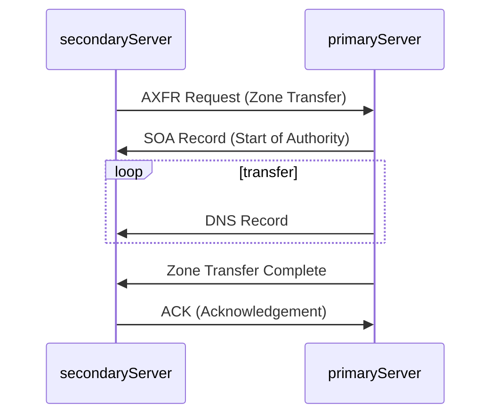

## 1. DNS Zone Transfer

A DNS zone transfer copies all DNS records of a domain and its subdomains from one name server to another. This ensures consistency and redundancy across DNS servers. However, if not properly secured, unauthorized users can download the entire zone file, exposing a full list of subdomains, IP addresses, and other sensitive DNS data.

**Why Does a DNS Zone Transfer Happen?**:

DNS zone transfers are crucial for keeping multiple DNS servers in sync. When a domain has multiple authoritative name servers, they need to share the same DNS records to provide accurate and consistent responses. Zone transfers ensure that secondary (backup) DNS servers receive updates from the primary DNS server, helping with:
- **Redundancy**: If one DNS server goes down, others can still resolve domain queries.
- **Load Balancing**: Multiple DNS servers can handle queries efficiently.
- **Faster Updates**: Changes to DNS records propagate across all authoritative servers.

The **zone transfer process** occurs as follows:
1. **Zone Transfer Request (AXFR):** The secondary DNS server requests a full zone transfer from the primary server.
2. **SOA Record Transfer:** The primary server responds with its Start of Authority (SOA) record, helping the secondary server verify if its data is up to date.
3. **DNS Records Transmission:** The primary server sends all DNS records (A, AAAA, MX, CNAME, NS, etc.) to the secondary server.
4. **Zone Transfer Complete:** The primary server signals the completion of the transfer.
5. **Acknowledgement (ACK):** The secondary server confirms successful receipt, completing the process.

