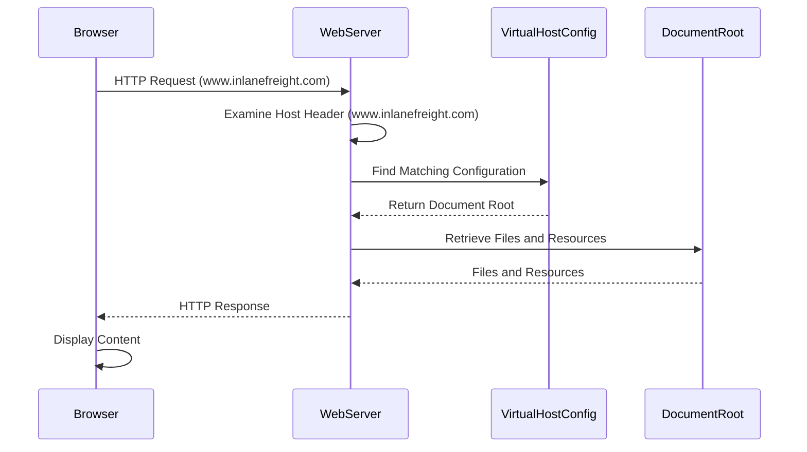

## 1. Virtual Hosts

> Once the DNS sends traffic to the right server, the web server decides how to handle incoming requests. Web servers like **Apache, Nginx, or IIS** can host multiple websites or apps on one server. They use **virtual hosting** to tell domains, subdomains, and different websites apart, ensuring each one serves the correct content.  

Virtual hosting allows web servers to handle multiple websites or apps on the same IP address. This works by using the **HTTP Host header**, which is included in every request a web browser sends. The server reads this header to deliver the right website.  

The key difference between **VHosts** and **subdomains** is how they relate to the **Domain Name System (DNS)** and web server configuration:

| Feature            | Subdomains                         | Virtual Hosts (VHosts)             |
|--------------------|----------------------------------|-----------------------------------|
| **Definition**     | Extensions of a main domain (e.g., `blog.example.com`). | Web server configurations to **host multiple sites on one server**. |
| **DNS Role**      | Have their own **DNS records**, pointing to the same or different IP as the main domain. | Can be associated with a top-level domain (`example.com`) or a subdomain (`dev.example.com`). |
| **Usage**         | Organize different sections or services of a website. | Allow separate configurations for multiple websites or applications on one server. |
| **Example**  | **Domain:** example.com **Subdomain:** blog.example.com | **Host 1:** example.com **Host 2:** elpmaxe.com **Host 3:** realweb.com |

**Note:** When accessing a ``virtual host``, which does not have a **DNS record** (usually not possible because there is no DNS to resolve domain names), you can still access it by **modifying** the `hosts` file on your local machine (mentioned in 2.2.2 - DNS.md). The ``hosts`` file allows you to map a domain name to an IP address manually, bypassing DNS resolution (meanning ur local machine will try to access directly to set IP address you added, without asking DNS to resolve IP).

> Websites often have subdomains that are not public and won't appear in DNS records. These ``subdomains`` are only accessible internally or through specific configurations. ``VHost fuzzing`` is a technique to discover public and non-public `subdomains` and `VHosts` by testing various hostnames against a known IP address.

### How web server (have vhosts, domain and subdomains) determines the correct content to serve based on the Host header:

1. Browser sends request to web server.
2. Webserver receives request and checks `Host Header` in request.
3. Webserver compares Host header value with Servername and ServerAlias ​​setting in its virtual host config.
4. Once found, server returns corresponding HTTP response.

**Types of Virtual Hosting:**

